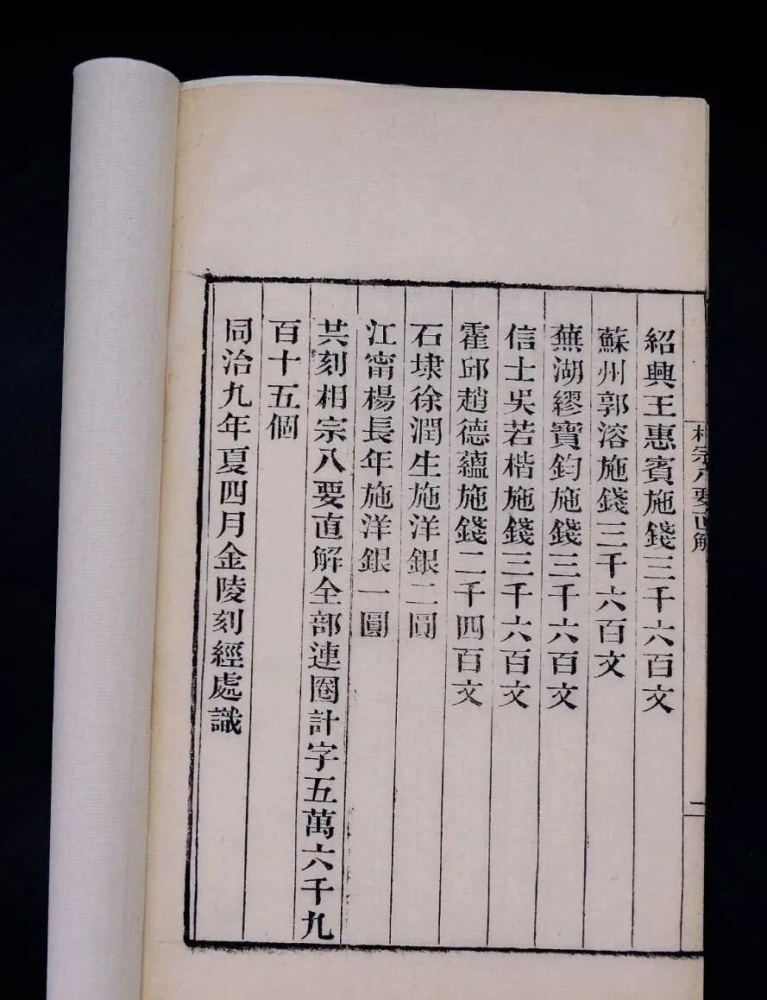
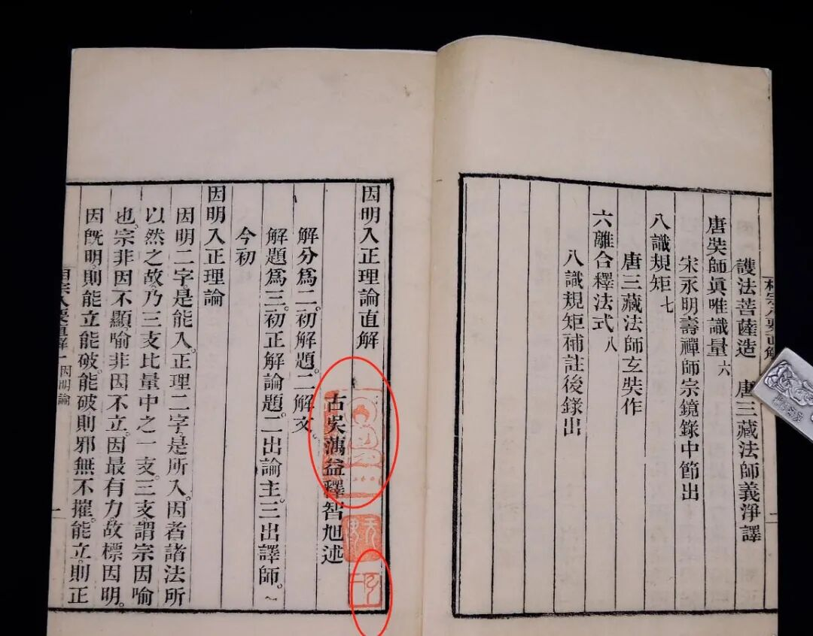
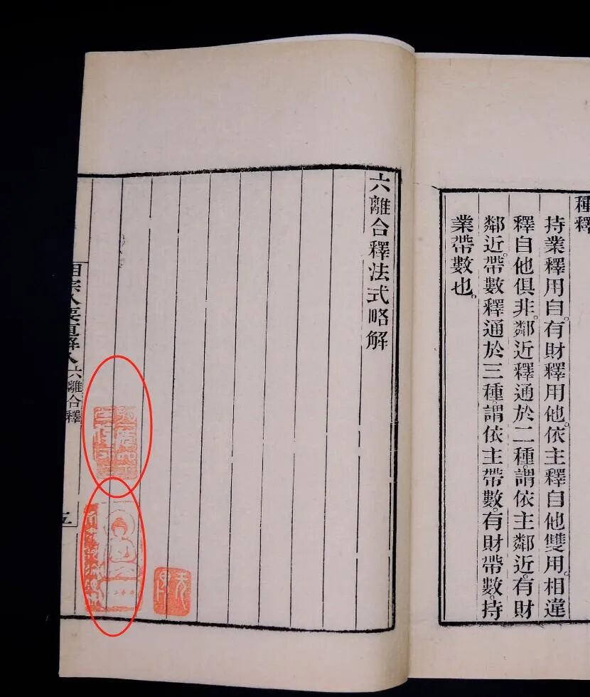
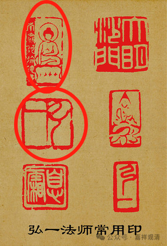
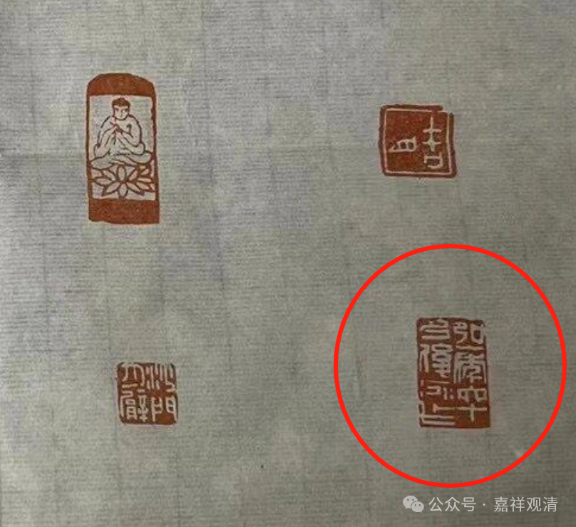
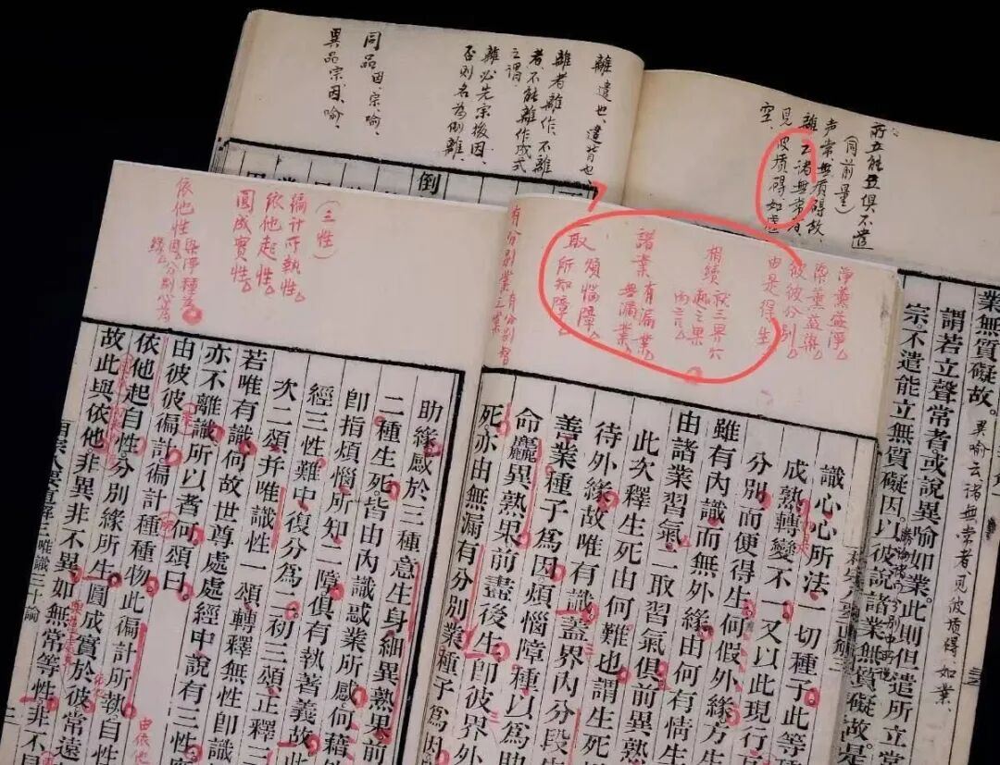

《相宗八要直解》与弘一法师

《相宗八要直解》，为明末四大师之一的蕅益智旭大师所作。

“相宗”，即“法相宗”，也就是唯识宗。“相宗八要”，是明代禅师雪浪洪恩所选，即：《因明入正理论》、《大乘百法明门论》、《八识规矩颂》、《唯识三十论》、《观所缘缘论》、《六离合释》、《观所缘缘论释》、《真唯识量》，晚明以后之禅僧着力于唯识者多攻习此，也包括蕅益智旭大师。

这《相宗八要直接》六册，为金陵刻经处同治九年（1870）所刊刻发行。

这里有一个佛像印和一个弘一法师的名章

这里有一个同样佛像印和一个弘一法师的章“弘一年六十后所作”。

全书首末都有印，看着都像是弘一法师常用的印章，而且最近这几个印章我经常看到。

这是网上找到的

也是网上找到的

感觉印章有点像。但是看书内的批注文字，不似弘一法师的文字。

不是说不是弘一体，而是笔迹字体表现为松散纖弱，而弘一法師小字则是遒麗認真。

所以感觉……

