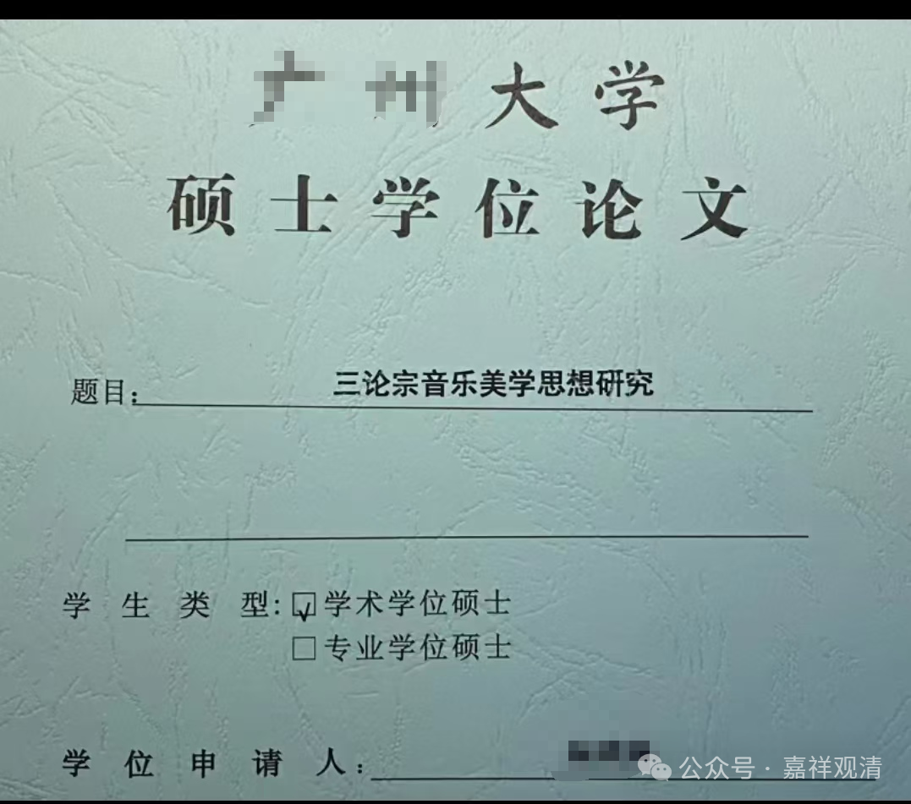

“**未及造釋，上生知足。** ”

《唯识二十论》是世亲论师自己写完颂以后自己做了《释》，但是《唯识三十颂》创作完以后，还没解释就圆寂了。这也造成了后来《三十颂》各家的解释差异性很大的情况。“上生知足”，“知足”，指的是“兜帅天”，后来翻译成都率天，我们私下里则翻译成“都帅天”，因为去“都帅天”的人“都”很“帅”，哈哈。那么，传说中世亲论师圆寂以后也投生在兜率天内院的弥勒净土。

兜率天有个“兜率内院”，那是弥勒菩萨讲经的地方，仔细讲的话，“兜率内院”在欲界而不属于三界所摄，属于在我们这个世界的“净土”。唯识圈子里面，大家多半都要求上生兜率天，都想去亲见弥勒。孙悟空去的太上老君的“兜率宫”则属于外院，和佛教没有直接关系。

这一段文字，昙旷法师从无著而世亲，认为世亲补足了唯识的教理……实际上他说的确实有点道理，也就是说，我们今天看起来这个弥勒学，这里面，弥勒的著作、无著的著作、世亲的著作重点确实不一样，它有一个层层解释的、递进的展开，表达得越来越精细。

比如说我们经常讲的唯识的三重空理，首先，像《瑜伽师地论》（慈氏）依《解深密经》来谈“三性三无性”，到了《辩中边论》（慈氏）、《摄大乘论》（无著）就表现为“能取所取空”或者“能取所取异体空”，到了《唯识二十颂》（世亲）和《唯识三十颂》（世亲）呢？它主要表现为“外境无”——这是唯识当中的三种空见，有一种层层解释的递进关系。

这个“层层解释的递进关系”，某种角度上来说是后者对前者的一种“非包含性”的解释，拿因明的词来说，它不是一种周遍的解释，并不是对上层理论的完美解释，是一种“近似”……

但是后人普遍愿意接受“接近自己时代的解释”，比如说，现在讲唯识的人很少讲“三性三无性”，讲空性的时候都去讲“外境空”，你像汉地的讲唯识空性的时候都去讲“外境空”，臧地讲唯识空性的时候则讲“能取所取（异体）空”，但实际上唯识最核心的空理应该是“三性三无性”，这个才是唯识在“形而上学”上建立的空观啊，而“能取所取（异体）空”，是用来解释“三性三无性”的，“外境无”是为了解释“能取所取（异体）空”的，后者是对前者的一种不完美的模拟，非百分百全同的解释。

我们今天来讲啊，唯识宗完美的形而上学应该是“三性三无性”啊，而且唯识宗或者唯识学，他的发展过程中还出现了一个现象，它和早期的西方哲学史很像，就是越到最后面，就越多地从形而上学析出新的学科——我们看到，从唯识宗里面，它慢慢地析出了法相（分析哲学）、因明（逻辑）、量论（知识论）、心明学（心理学）……从形而上走向了形而下，从抽象走向了具体，你再给他点时间，它都能给你析出美学来，哈哈……

不信你LOOK上面这个，隔壁已经有了……

