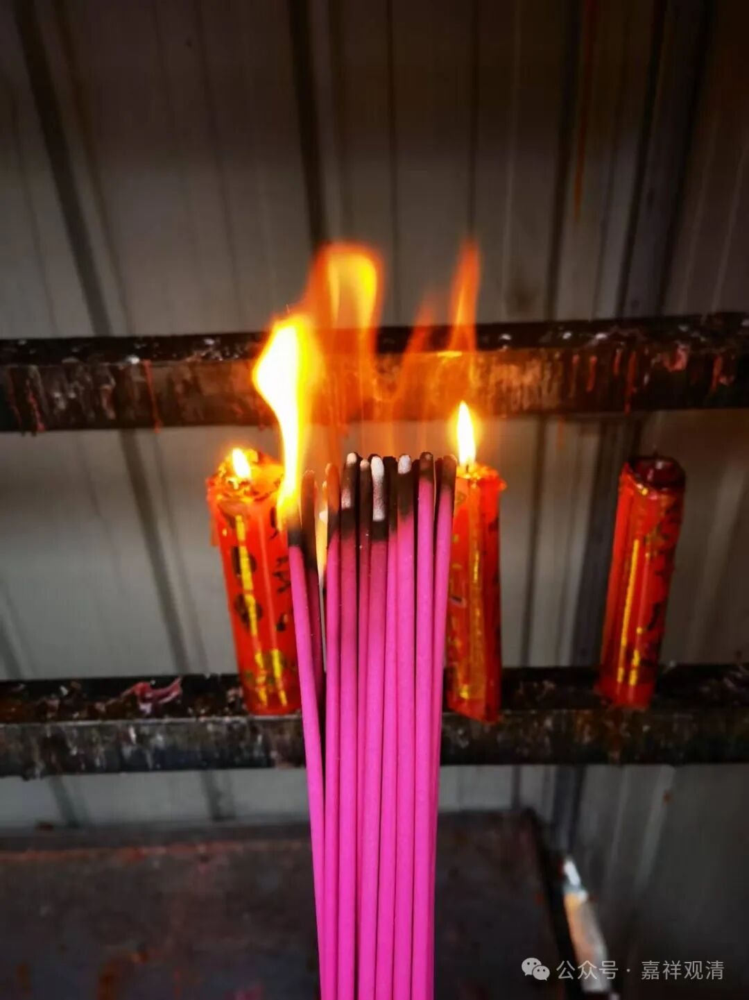
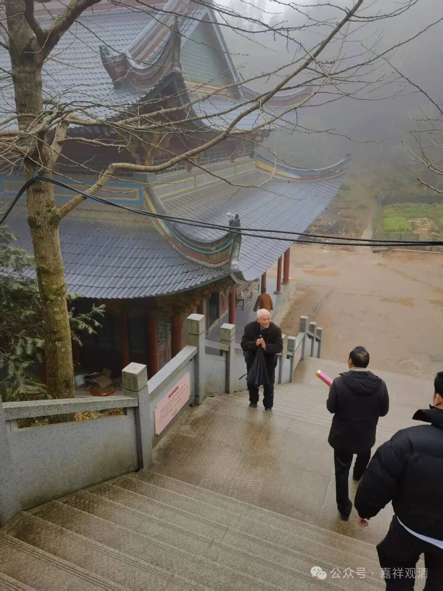

老郑回来了！

今天正月初五，全国都在供财神。

疫情以前，咱这小庙正月初五是没几个人来的，当地人的风俗是“三六九”上香，初三、初六、初九、十三、十六、十九……这样，完全没有“初五拜财神”的习俗。这几年这个新风俗起来了，应该是外出的年轻人带回来的——看来人口大流动可以主动完成文化趋同。

上午老郑也回来了。

老郑就是文革后最早来恢复寺院的。他是附近人，身体不好，七十年代末二十岁刚出头就来莲花山了……

那时候白云寺完全毁于文革，真的是“唯名言有而自性空”了。他就在今天观音殿的地方搭了一个茅棚居住，在今天文殊殿的地方又搭了一个小厨房，后来又在今天地藏殿这里用木头搭了一个木板房供地藏。

他一个人就在这样一个“寺院”住下来……

有一次，当地一个混子上山把他打了，抢了五百块钱下山（那个时候五百块钱也是巨款了），居士们上山看见他牙都被打掉、香火钱也被抢了，便报了警。很快作案者被抓到、判了刑。前两年那个主审法官退休来了寺院，正遇到我和老郑，法官很激动，掏出他的证件，向我讲了那件事情。他说，那年他也刚工作，这件事情他记得特别清楚……

老郑来来回回，走了又来，来了又走，现在在他弟弟厂里看大门，离这里也不算远，三十公里路吧。我知道他这几天一定会来，但不知道具体哪天。果然，今天他弟弟送他来了……祝他身体健康！

