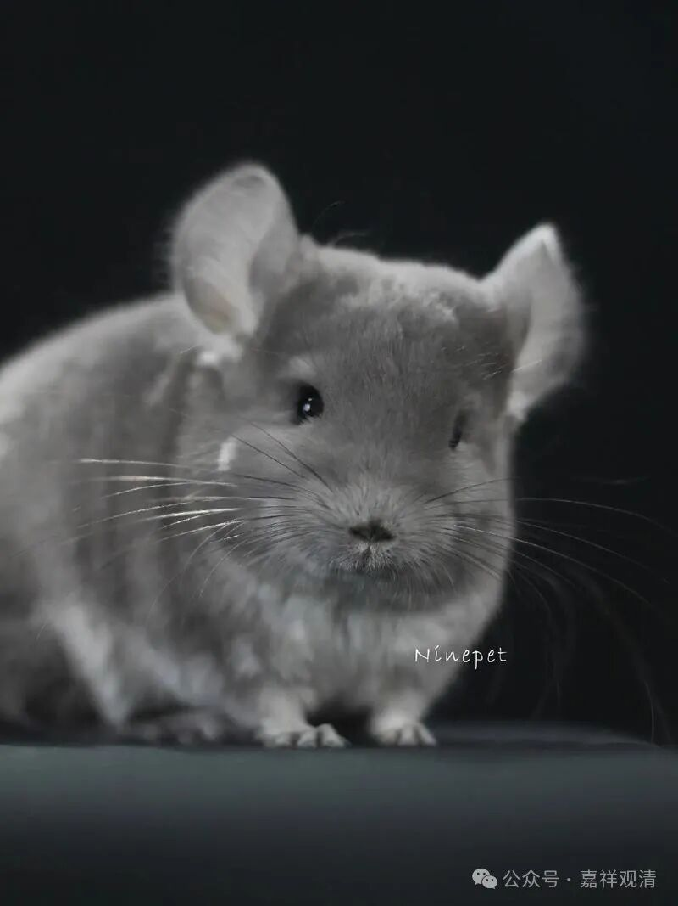
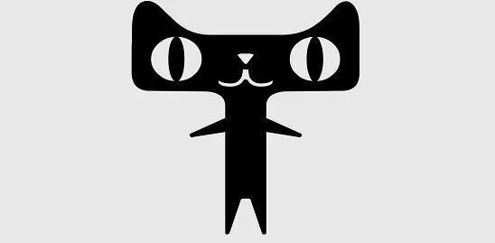
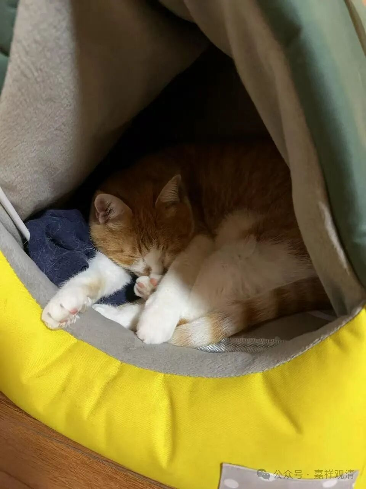
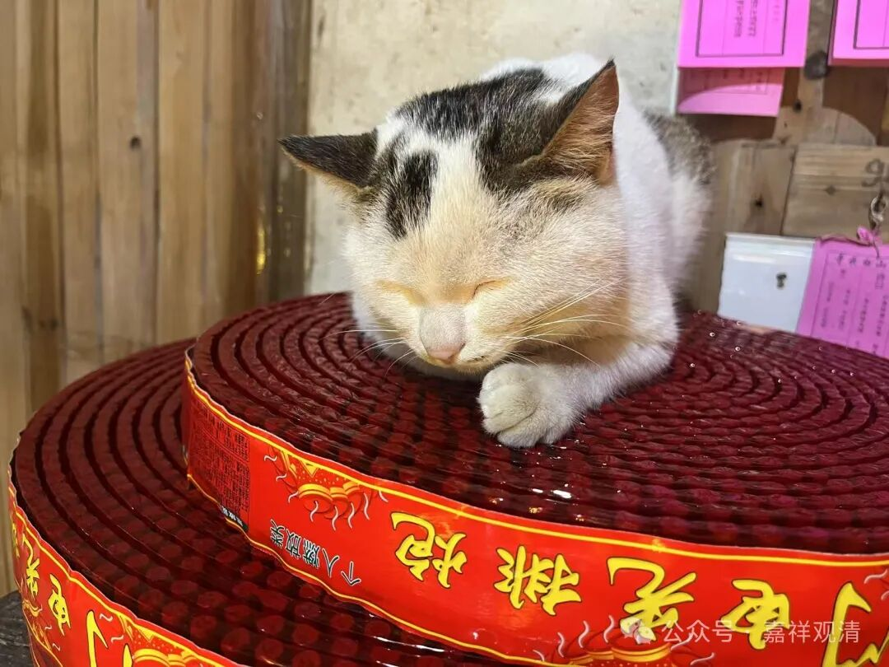

龙猫、天猫，和乔丹

现在庙里有两只猫，都是大佬级的！一只叫龙猫，一只叫天猫！

龙猫不是它，

也不长这样

天猫也不是它

上面这只就是咱的龙猫，还有宿舍。

这只是天猫，帮忙看着签房。

放假时间太长，居士们不能把猫留家里不管，也舍不得把小猫寄养，于是把自己的猫提溜来，又正好趁机会蹭个“归依”。皈依了以后要给个名字，顺嘴就叫了“龙猫”，龙字辈的嘛，哈哈……

这只是去年十月份庙里讲《入中论》的时候，龙相师给做的“归依”，所以叫“天猫”。

哈哈，我们庙里要是真有了龙猫和天猫，哪怕只有其中之一，那也是要啥有啥了。

这两天，庙里唯一的一条狗乔丹又不见了。我以为又被人偷走了……

老胡说，乔丹每天早晚还会来吃饭的，但吃完饭就走了。我说那应该是庙里炮仗声音太大逃了。以前小黑们也很怕鞭炮，一有鞭炮响就逃走……（两只猫胆子倒大，基本没影响。）

老胡说不是，说乔丹下山谈恋爱去了，乐不思蜀，不着家了！

渣男！

