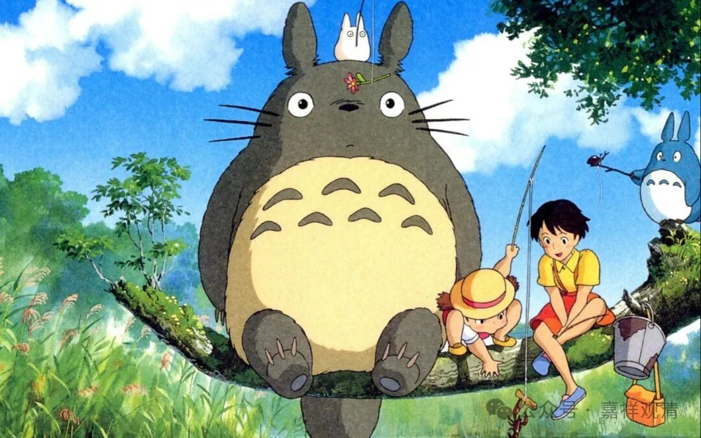

从解脱走向束缚

还俗就只剩活着了

又看到俩出家人还俗，都去做了心理咨询……呵呵，衣服换了，头发蓄了，“好为人师”的习惯却改不了了。

现在还俗做心理咨询的太多了，那啥啥宇五年前就玩心理咨询，终于蓄发成了白衣，理直气壮地说更方便服务众生，呵呵，当大家傻呢？其实就是妆点自己烦恼，把自己的退心包装成菩萨行，有几个人看不懂呢，都多余包装的！

一类出家人还俗，肩不能扛，手不能提，世俗技能所剩无几，只能换到隔壁赛道，继续摇唇鼓舌……不然吃啥？！很多人出家时就以心理咨询为“爱好”，江苏某寺曾鼓励出家人考心理咨询师，寺院做公益心理咨询热线……两年后，一堆白净和尚终于在“共情”中“移情”了，最后“心理热线”也终于“断线”了。

还有一类换了个颇为古怪的赛道，四川某寺院的另一堆黝黑和尚做了健身教练，他们是因为平时“出坡”太多练的块儿大吗？

有个法师在寺院跑步锻炼，隔壁老和尚看烦了，说：“某某师，你知道吗？现在社会上健身教练的需求没那么大，你还俗了也当不成教练！”

