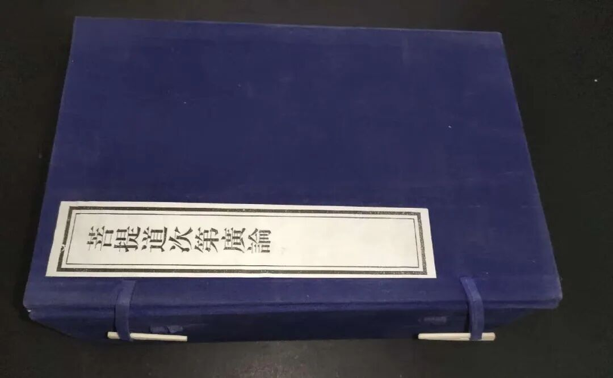

《道次第》的“三别法”和“四殊胜”

问：什么是《道次第》的“三别法”和“四殊胜”？

答：有些道次第的解释书里会提到“三别法”和“四殊胜”，这其实就在《广论》最前面就有。

“三别法”是指道次第相对于其他教授的差别之处。《广论》说：

“具攝經咒所有樞要而開示故，所詮圓滿；調心次第為最勝故，易於受持；又以善巧二大車軌，二師教授而莊嚴故，勝出餘軌。”

即：1、总摄一切显密关键而开示、引导，这是所诠内容圆满；

2、展开了修心次第，这令学者易于上手操作（实修）；

3、包含了深见、广行（龙猛、无著）的教授，超过其余的轨则。

关于四种殊胜，《广论》说：

“此論教授殊勝分四：一、通達一切聖教無違殊勝，二、一切聖言現為教授殊勝，三，易於獲得勝者密意殊勝，四、極大罪行自趣損滅殊勝。”

1、令人明确一切佛语不相违背，是一个整体；

2、明确所有的经典都是引导修行的；

3、容易通达诸佛的密义说（一切法的核心是三士道、三主要道）；

4、不令行者生起谤法的错误。

