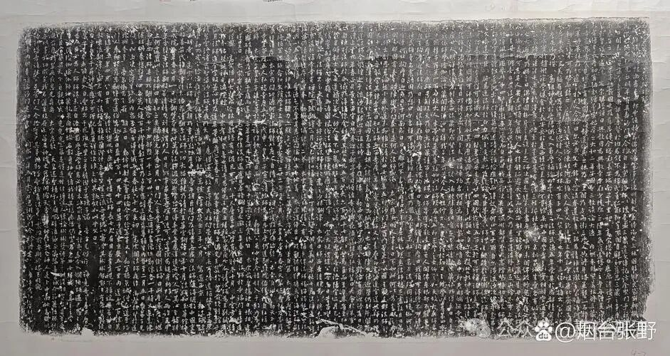

接下去我们就连上上次我们讲的了。

“**我唐貞觀有大三藏遍覺大師，厥名玄奘，幼小出家，志高世表。師無遠近，業該內外，中夏法理既遍研精，他方教跡願就尋究。遂拂衣東夏，杖錫西天，周遊道邦，博訪經詰，窮先賢之謬見，通古德之未聞，名立義成，來歸本土。** ”

玄奘法师主要活动在唐代贞观年间，“三藏”是说他通达佛教的经律论三藏。“大遍觉”是唐中宗给玄奘的谥号叫“大遍觉”，西安兴教寺玄奘塔有《唐三藏大遍觉法师塔铭》，唐文宗开成四年（839）刻。僧建初书，屯田郎中侍御史刘轲撰文。原碑镶嵌于西安玄奘灵塔底层北面壁上。

玄奘法师幼小（十三岁）出家。他哥哥也出家了。家里面原先呢，也算是这个官宦人家。然后呢？哥哥出家了，他也跟着哥哥一起出家了。然后最初他也是学的唯识，那么学了唯识以后呢觉得有点不完全明白，特别是对这个《十七地论》，也就是玄奘法师后来主要翻译的《瑜伽师地论》，那对唯识的教理呢，总觉得还有一些还差一口气啊。

那个时候的这个唯识教理，有一支是真谛法师带来的，那么真谛法师那一系呢，是安慧论师一系……然后是真谛法师翻译了很多经典，也带出了很多徒弟，主要在南中国一带流行啊，在南北朝的这个南朝一带进行流行。南朝那个时候时候战乱比较多，所以很多的真谛翻译和讲义这些文献也都缺失了。

玄奘法师学了唯识学（《十七地论》《摄大乘论》《十地经论》）和说一切有部的经典（《俱舍论》）以后呢，他还想继续找名师学习。这个时候正好这个大唐也在上升期，实力也很强……玄奘刚动身去印度的时候，大唐还没有把西域（今天新疆一带）完全拿下来，还没有实际控制，等玄奘去了印度一段时间以后，大唐已经实际控制了西域地区了，所以他回唐就更加轻松了。

“志高世表”，玄奘法师当时还很年轻啊，志气就很远大啊，超出一般的世间啊，所以这叫“志高世表”。

“师无远近，业该内外”。这个师就是他师从啊，他的老师不管是近还是远，他都会去依止啊，去学习。这个“业”就是学习啊，“该”就是包含、普遍，意思是，玄奘法师对于内道和外道，或者说是内学和外学都很了解，他对佛教了解啊，对外道的一些东西也很了解啊。

玄奘法师对道家也是有了解的，在《集古今佛教论衡》当中，他对道教也做过一些回应啊。虽然文字上并不多，因为它的主业是翻译嘛，那也说明他对这个外道、外学，对当时主要的道和儒也都会了解一点。

