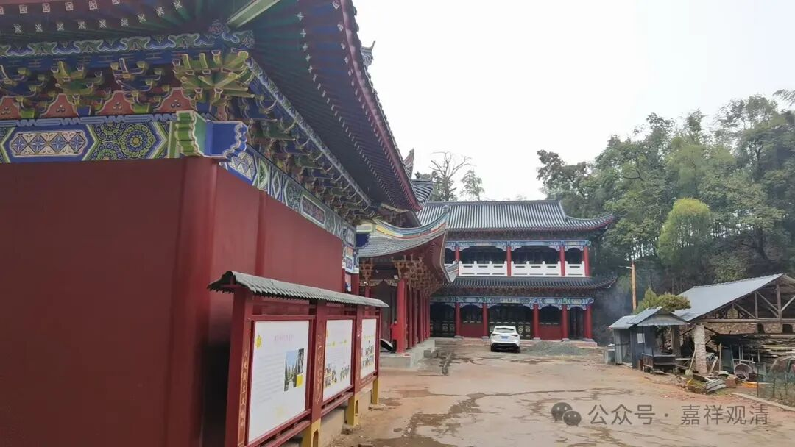

正月不催债

大年初十，老周来了。

老周是我们的“包工头”，哈哈，他来干什么，你懂的。

老周原定是初八来，我说这两天我上课忙，于是改在今天来。我们估计他们应该下午到……过来路上，肯定先吃个午饭再上来——庙里可是全素，他们受不了啊，哈哈。

下午讲完课回房间，看到房间门口，坚果、车厘子和榴莲，哈哈，说明老周到了。哈哈，换了衣服，他正好上来“百年”，于是一起下工地走一圈……谈谈今年的规划细节……明天上午继续下工地谈细节……

晚上他们还是在庙里吃饭，我们一直在开玩笑，老胡“哭穷”后问他，“是不是来讨债来啊”，老周笑着说，“这个是有规矩的，我们知道，过年期间不谈钱、不要债……”哈哈，还挺讲“规矩”的。

去年年底，他们是反过来跟我“哭穷”，让我“给点钱”让他度度“年关”，哈哈，我笑着说，“不要说‘年关’这个词，‘年关’是什么意思啊？我也不是地主，没把你们逼成这样子吧……”，我说，我一向很自觉的，不要瞎找理由

老周们在庙里做了几个工程，和我们算是老朋友了，我说你们在我们这里干了几年活了，生命中的一小部分都在庙里了，以后老了就过来，不要在人世间想不开了，“各人因果各人了”，家里就早点放手吧……老周没敢答应，哈哈，推说孩子还小……龙意师问老周、小周“要不下辈子出家？”依然不敢答应……

明天上午去综合楼，下午可能去家具厂……我跟老胡说：人家都正月不催债了……要不我们主动点？

