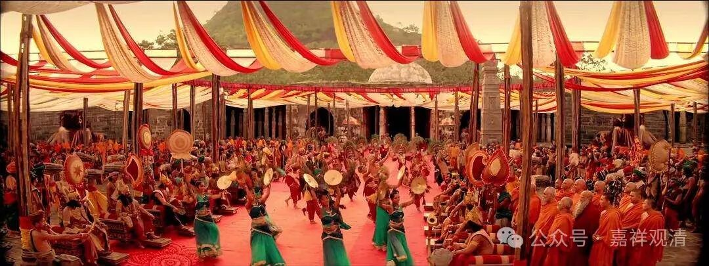
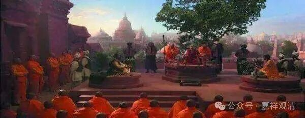
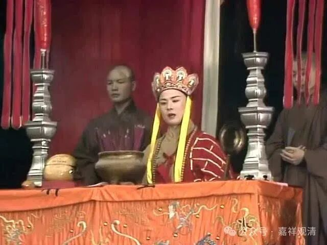

“名立義成，來歸本土”。“名立”，他的名声在这个印度立下了；“义成”，他的观点立住了。玄奘法师在印度无遮大会上立“真唯识量”，没有人能够挑战成功，被大家称为“解脱天”和“大乘天”，这就是“名立义成”了。

当时，印度小乘的佛教界给了他一个“解脱天”的称号，大乘圈子则给了他一个“大乘天”的称号——牛啊！

我有一个新的说法啊，大家听听看——

传统上认为，玄奘的弟子多有称“大乘某”的，以大乘为名号，比如擅《俱舍》的普光法师叫“大乘光”，擅唯识的基大师叫“大乘基”……一般认为他们法名里的“大乘”是因为他们都受了瑜伽菩萨戒（大乘戒）而叫“大乘光”“大乘基”的，我认为其实还有一种可能，就是，这个“大乘”实际是继承自玄奘法师的“大乘天”里的“大乘”——有的传统里，弟子的“法名”里会带有师父法名的一部分。

玄奘法师在中印度无遮大会（国际大专辩论会）上立了一个辩论的主题，然后成功的站住了，这就叫“名立义成”。后世通常认为这个辩论主题就是“真唯识量”，就是一个论证式子：

宗（观点）：真故极成色，不离于眼识；

因（理由）：自许初三摄，眼所不摄故；

喻（比喻）：犹如眼识。

这里的“真故”的“真”，就是指的“胜义（谛）”、“究竟”；“极成”，就是立（论者和）敌（对方）双方共许，“极成”的本意是所有人普遍接受、“终”极“成”立；“自许”，就是自宗所许、“本派认为”……现在也有新观点认为那次辩论会上建立的观点不是这个“真唯识量”……这个大家有兴趣的话我建议可以晚上烧纸问问，哈哈，你们有答案了记得告诉我。

玄奘法师确实是在“名立義成”以后不久就回“东土大唐”的，这就是“來歸本土”。有一种说法，说玄奘法师是中国古代最牛的海归，哈哈，有点这个意思。

