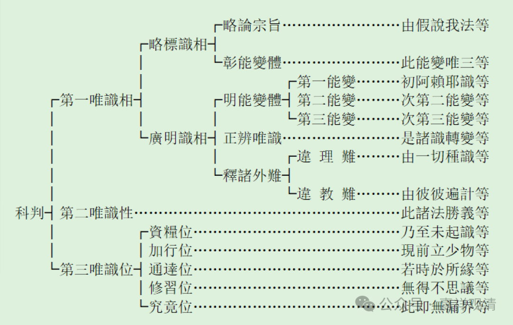

“**於中大分以為三段：初一頌半略辨唯識，次有二十三頌半廣辨唯識，後有五頌顯修行位。** ”

《唯识三十论》和《唯识二十论》一样，都“唯有正宗分”。“于中大分以为三段”。《要释》的意思，是大的科判的话，把它分为三段。——“初一頌半略辨唯識，次有二十三頌半廣辨唯識，後有五頌顯修行位。”

这是昙旷《唯识三十论要释》的科判。

我们先来看一下通常所见的玄奘——基大师一系的科判。

“謂此三十頌中，初二十四行頌明唯識相；次一行頌明唯識性；後五行頌明唯識行位。就二十四行頌中，初一行半略辯唯識相；次二十二行半廣辯唯識相。”

这是《唯识三十颂（论）》自带的科判，应该是玄奘门下做的。

就是这张图，大家可以看一下啊。我们看这里面它的分类比较，这个科判是谁的呢？这个科判是属于护法——玄奘系唯识的说法。

这个科判和《要释》的科判是有点不一样的。《要释》的科判是1、“略辨唯識”，2、“廣辨唯識”，3、唯识位。按照我们现在这个玄奘系内部常用的科判，则是分成三种，1、唯识相；2、唯识性；3、唯识位。这个是护法系的分法啊。

两种科判都有的这个“唯识位”“修行位”，在安慧的《唯识三十论》（即安慧论师的《唯识三十颂释》）当中是完全没有这个解读的——他并不解读为“唯识位”。

