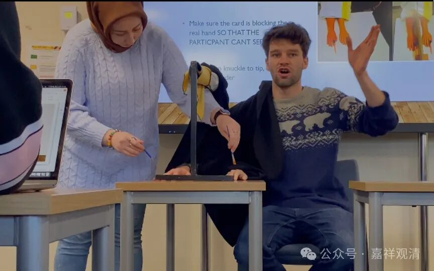

“**依斯二分，施設我、法** ”，由在见分、相分上施设我、法。

“**彼二離此無所依故。** ”“……故”，就是理由，因为“我”“法”离此见分、相分无所依，所以“我”“法”是在见分相分上施设的。这句话我们前面讲了啊，头就大在这个地方，就是这句话，不是所有唯识师都承认的。“彼二離此无所依”吗？不见得的，安慧就不认。但是作为护法自宗的教材，是可以这么说的。

他（护法）这里的逻辑是：施设的“我”“法”必须各有个“所依”，由于施设的“见分”“相分”有各别的作用，所以他们有各别的实体，才能堪为“我”“法”的所依，若见分、相分作用不同而又同体（自证），那就变成了“用别体同”了。

说起来，《成唯识论》里这一段把安慧说和护法说掺着说，在文字上顺下来很是有点拗口，根本就在于那句“见相皆依自证起故”，这句话实在是两家都不认可、不接受的。

我们继续讲下去啊。“依斯二分，施設我、法，彼二離此無所依故”，这句话可以说是护法讲的，说陈那讲的都可以。

但是让我们来说，我和法，是不是必须在实有的见分、相分上生起呢？我们中观宗是不认可的，世间人也未必认可。比如说在一个完全不存在的东西上，认为它是“我”有没有可能？实际上是有可能的吧，就是说你不是在一个实法上的执为是我，你本身就是在一个假法上，甚至不需要存在，也可以“执为我”。前两天我们讲课的时候就举过这个例子吧，打游戏，大家在一个房间里面，一起打游戏，“哎，你挡到我了，哎，让开一点”，“哎呀，你怎么我了”，这个时候你这个“我”，是在那个游戏里的某个角色上，这个角色是假法，但我们在它上面生起“是我”的想法。

甚至……你们应该还记得有个什么幻肢实验吧？把那个手拿个塑胶的东西在那里划着划着划着，这个大家知道吧？切一半对吧？划着划着这幻肢咔嚓往上一砸，哈哈哈……那个实验，是吧。它不一定是实法才可以是所依，所以我们会讲，实际上我和法的施设，不一定需要落在实法上，是可以在假法上的，按中观的说法，甚至必须落在假法上——“假不依实”。

