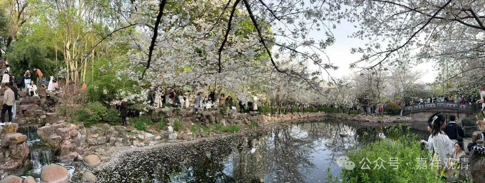
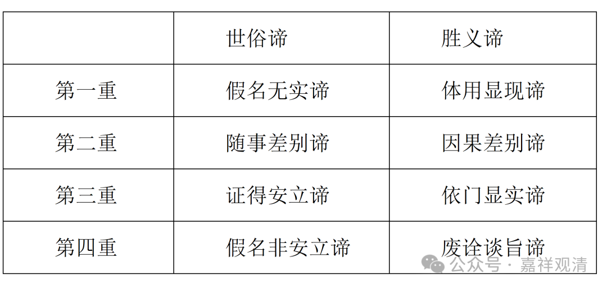

那么这里我们来看一下唯识派的四重二谛说。

唯识派的“四重二谛说”也是发展而来的，我们这里就不多聊他的历史渊源和历史背景了，单聊汉传玄奘系发展出来的“四重二谛说”。

来看表格：

世俗谛

胜义谛

第一重

假名无实谛

体用显现谛

第二重

随事差别谛

因果差别谛

第三重

证得安立谛

依门显实谛

第四重

假名非安立谛

废诠谈旨谛

“四重二谛”中，其实实际就五个内容，就是，前一重的胜义谛就是后一重的世俗谛。比如，第一重的胜义谛是“体用显现谛”，就是第二重的世俗谛“随事差别谛”；而第二重的胜义谛“因果差别谛”，就是第三重的世俗谛“证得安立谛”；第三重的胜义谛“依门显实谛”就是第四重的世俗谛“假名非安立谛”；那么加上一头一尾，实际内容就是五个。

我们一个一个来看：

第一重世俗谛，假名无实谛，这个就是“我”“法”这一类的，还有，比如中观里常说的“瓶、衣、帐、军、林、鬘、树”，都属于这一类；这一类就是“唯假”；

第二重世俗谛，随事差别谛，也就是第一重的胜义谛“体用显现谛”，这个是什么呢？蕴、界、处等。我们先顺下来说，待会儿再讲每一重世俗、胜义之间的关系和相应的历史背景、宗派背景……加入我们想说的话。

第三重世俗谛，证得安立谛，也就是第二重的胜义谛“因果差别谛”，这个是什么呢？苦、集、灭、道等。这里我们看，上一重的蕴界处也是一切法，这一重的苦、集、灭、道也是一切法，所以上面一重就不能简单地讲“一切法”了

第四重世俗谛，假名非安立谛，就是第三重的胜义谛“依门显实谛”，就是我空、法空之理。

第五，就是第四重的胜义谛，“废诠谈旨谛”，就是真如。这里面要小心，第四重世俗谛和胜义谛不是一件事，有人把第四重的世俗谛解释为“真如”的，错！《述记》明确说是“二空理”，“二空理”，不是“二空”！我一再提醒大家乐，看经典的时候，不要漏字！一个字都不能漏！！这不是看小说！！！

我们注意一下，这里面没有龟毛兔角。为什么？因为龟毛兔角不存在，不是法，不在讨论之列。二谛三性都是在法（有、存在）上说的。

