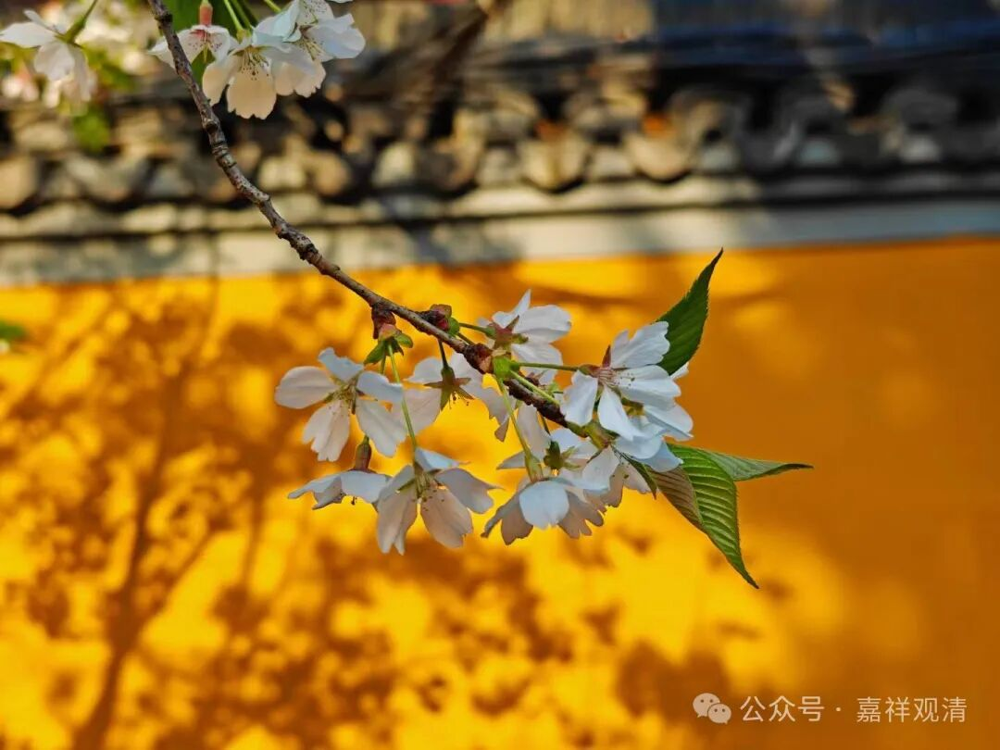

基大师的“四重二谛说”是有其宗派传承和历史背景的，其宗派的背景板是世亲论师在《辩中边论》里面提到的三种世俗和三种胜义，历史的背景则是三论宗吉藏(略早于玄奘)提出的“四重二谛”说。

世亲论师在《辩中边论》中说：

“应知世俗谛，差别有三种，

谓假、行、显了，如次依本三。

胜义谛亦三，谓义、得、正行……

世俗谛有三种：一、假世俗；二、行世俗；三、显了世俗。此三世俗，如其次第，依三根本真实建立。胜义谛亦三种：一、义胜义，谓真如，胜智之境名胜义故；二、得胜义，谓涅槃，此是胜果，亦义利故；三、正行胜义，谓圣道，以胜法为义故。此三胜义，应知但依三根本中圆成实立。”

说，世俗谛有三种，分别是：一、假世俗；二、行世俗；三、显了世俗。假世俗就是遍计所执性；行世俗就是依他起性；显了世俗就是圆成实性。这个比较简单，直接对应了唯识的三自性。“三根本”就是“三自性”。

胜义谛也分三种：一、义胜义；二、得胜义；三、正行胜义。这里，第一个“义胜义”的“义”就是境的意思，“义胜义”指的就是真如，是胜义理智的所缘境；二、得胜义，这里解释就是涅槃；三、正行胜义，就是圣道。

这里就变得有趣了，《辩中边论》的三种胜义和清辨的三种胜义几乎完美契合！

中观派清辨论师也说胜义有三，和这里几乎一模一样。

第一，清辨论师说，“胜义谛”是一个“依主释”的结构（“依主释”是梵文佛和此的构词法中的“六离合释”之一，意思就是“A之B”的构词法），“胜”指的是胜义理智，“义”，指的是对境，“谛”就是真实——那么第一种“胜义”就是“胜义理智的所缘境”了，就是真如，和《辩中边论》一样。

第二种胜义，清辨论师解释为“持业释”的复合词结构，就是，“A即B”，“胜”即是“义”即是“谛”：“胜”，解释为“最胜”，“义”还是境，“谛”，还是真实——最殊胜的、真实、境，还是真如。《辩中边论》的第二种“得胜义”，说“得胜义，谓涅槃——此是胜果，亦义利故”，这里的“涅槃”，就是真如；“此是胜果，亦义利”就是“A即B”，持业释，就是“胜”即是“义”。

清辨的第三种胜义，叫随顺胜义，或者解释为与胜义有关的，《辩中边论》的第三种胜义则被释为“三、正行胜义，谓圣道，以胜法为义故”，以最殊胜的真如为境，朝向涅槃，正是“随顺胜义”。

所以，很有趣哦，中观自续派大师清辨的“三种胜义”和《辩中边论》的“三种胜义”是完美契合的！（月称的“三种世俗”和《辩中边论》的“三种世俗”不契合。）

