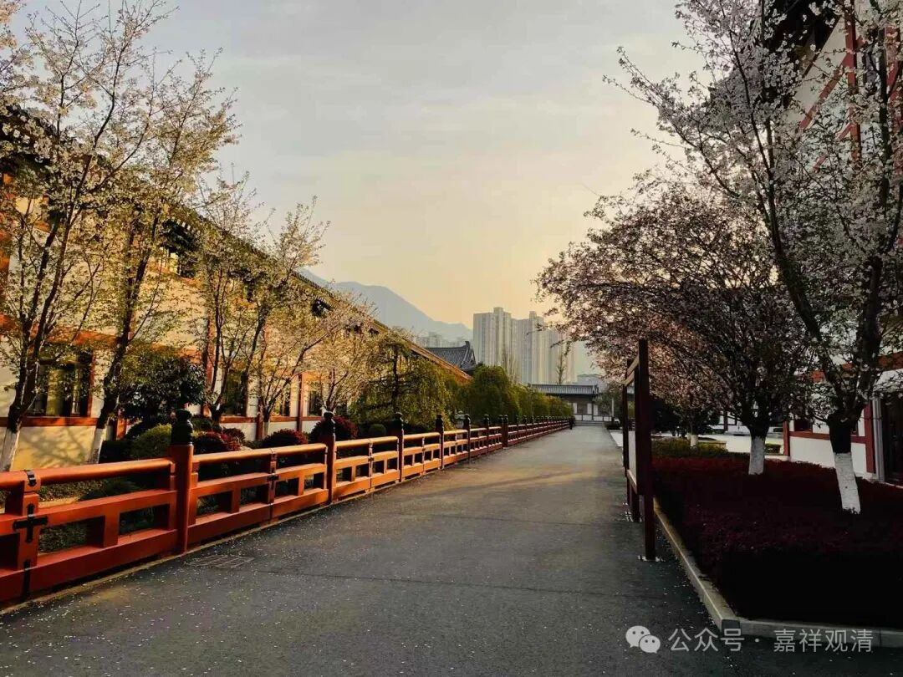
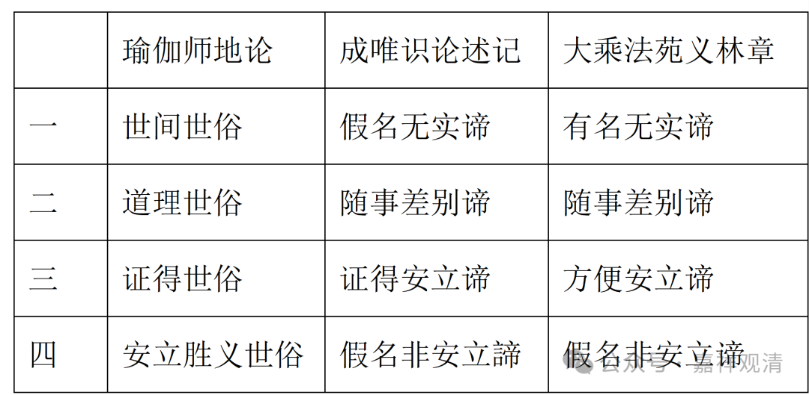
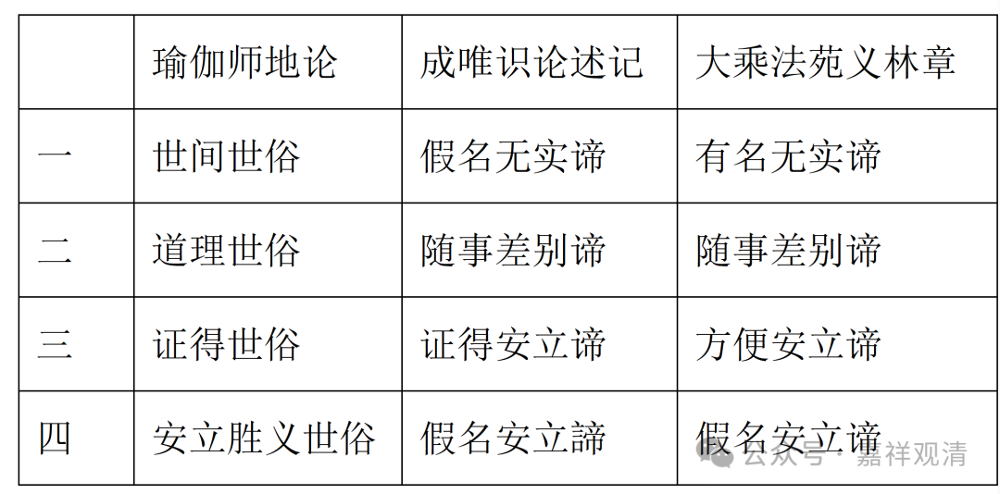

基大师“四重二谛说”，直接的来源，就是《瑜伽师地论》。

《瑜伽师地论》卷六十四：

“**以略安立三种世俗：一、世间世俗；二、道理世俗；三、证得世俗。世间世俗者，所谓安立宅、舍、瓶、瓫、军、林、数等，又复安立我、有情等。道理世俗者，所谓安立蕴、界、处等。证得世俗者，所谓安立预流果等彼所依处。

** 又复安立略有四种，谓如前三种世俗，及与安立胜义世俗，即胜义谛，由此谛义不可安立，内所证故，但为随顺发生此智是故假立。

**云何非安立真实？谓诸法真如。** ”

这是说唯识对“世俗”有“三种世俗”或者“四种世俗”的安立，“四种世俗”说是包含了三种世俗说的，所以我们就按这里《瑜伽师地论·抉择分》的“四种世俗”来说，其中前三种单独拿出来就是“三种世俗”说了。

第一、世间世俗，就是我、有情、舍宅、“瓶、衣、帐、军、林、鬘、树”等。《瑜伽师地论》诸本最后都是“数”，应该是讹误，按一贯的用法来说应该是“树”字，也和其他的例子比较合拍。

二、道理世俗，《瑜伽·抉择分》说就是蕴、界、处等。这两个和《成唯识论述记》的前两种世俗的说法完全一致。

三、证得世俗，《抉择分》说是“**预流果等彼所依处** ”，而《成唯识论述记》说是苦集灭道四谛，合说的话，可以解释为圣者所依的道谛中的“见道、修道、无学道”，可能“无学道”要拿掉，在讨论看看，可能拿掉比较好。

第四、安立胜义世俗，结合下文，它指的是安立真实世俗，意思是，对真如的名言安立、施设、解释。

《抉择分》最后又加了一个“非安立真实，谓诸法真如”，这很明显就是《成唯识论述记》“四重二谛说”的“第四重胜义”——废诠谈旨谛，真如！

我们来对照上面讲的基大师的“四重二谛”来看，几乎一模一样。

世俗谛

胜义谛

第一重

假名无实谛

体用显现谛

第二重

随事差别谛

因果差别谛

第三重

证得安立谛

依门显实谛

第四重

假名非安立谛

废诠谈旨谛

我们再对照《瑜伽师地论》《成唯识论述记》和《大乘法苑义林章》，看一下唯识宗“四种世俗”的“名言差别”。

瑜伽师地论

成唯识论述记

大乘法苑义林章

一

世间世俗

假名无实谛

有名无实谛

二

道理世俗

随事差别谛

随事差别谛

三

证得世俗

证得安立谛

方便安立谛

四

安立胜义世俗

假名非安立谛

假名非安立谛

这里就有一个问题，第四世俗！《述记》和《义林章》都作“假名非安立谛”，其实按《瑜伽师地论·抉择分》，应作“假名安立谛”，“非”字不能加！只有这样才说得通，因为只有第四重胜义的“废诠谈旨谛”才是“非安立谛”！而且，“假名”和“安立”才合拍，“假名”和“非安立”不合拍，除非解释为“对‘非安立谛’（即真如）的‘假名安立’”。

我们看《抉择分》，说的是“安立胜义世俗”，谛，就是真实，就是胜义，“安立胜义”，就是“安立谛”，对“安立谛”的“假名”，应该叫“假名安立谛”！

那表格就应该变成——

