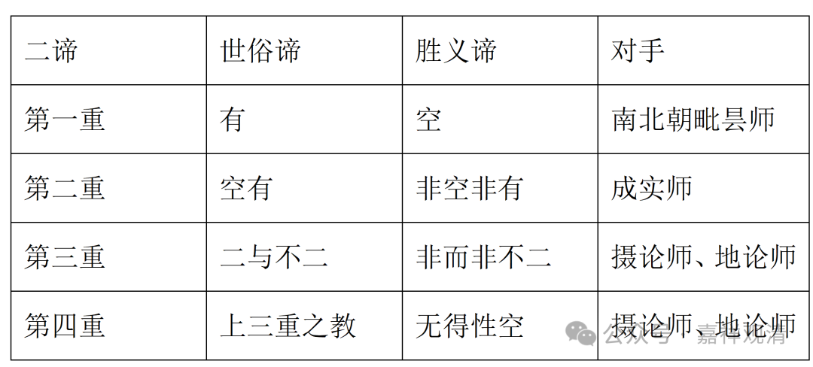

吉藏《中观论疏》卷二·本：

“**（一者，）有為世諦，空為真諦；……

** 二者，他但以有為世諦，空為真諦。今明，若有若空皆是世諦，非空非有始名真諦。

**三者，空有為二，非空非有為不二，二與不二皆是世諦，非二非不二方名為真諦。

** 四者，此三種二諦皆是教門，說此三門為令悟不三，無所依得始名為理也。**”

我们简单制表如下——

二谛

世俗谛

胜义谛

对手

第一重

有

空

南北朝毗昙师

第二重

空有

非空非有

成实师

第三重

二与不二

非而非不二

摄论师、地论师

第四重

上三重之教

无得性空

摄论师、地论师

吉藏的“四重二谛说”很明确是有假想敌的，每一重都有针对的具体对手，是对对手“二谛论”的矫正。

这里需要先简单介绍一下的，就是他的几个对手、假想敌。

毗昙师：本来“毗昙”就是“阿毗达磨”的旧译，各宗都挺有阿毗达磨，所以他本来应该是一个泛称，但这里的“毗昙”则特指“说一切有部”，但这个“说一切有部”不是纯印度的“有部”，而是南北朝时期中国的“毗昙师”，是一批不是很纯的、甚至有着部分大乘背景的“有部异师”。所以，这里提到吉藏批评毗昙的二谛说，实际指的是南北朝时期的这些汉地毗昙师们提出的“二谛说”，并非《俱舍》的“二谛说”。

成实师：本来“成实师”要算“经部师”或者“经部异师”，但这里针对的也是南北朝时期的以灵、旻、藏（三位著名的成实师）为代表的“成实大乘师”提出的二谛论。

地论师、摄论师：“地论”，指的是《十地经论》，作者世亲；“摄论”，指的是《摄大乘论》，作者无著。南北朝时期，唯识的这两部论都翻译了过来，出现了专宏的“地论师”和“摄论师”，大约相当于汉地早期的（不那么纯的）唯识师。

这三家或四家，大概可以理解为中国南北朝时期汉化版的有部、经部和唯识，再加上吉藏的自宗“三论”就是中国化的中观宗，就恰好凑足了“四宗”——吉藏大师的作品里有很明确的、很自觉的“四宗叙事”结构。这也算是一种中印佛教的隔空握手了。

