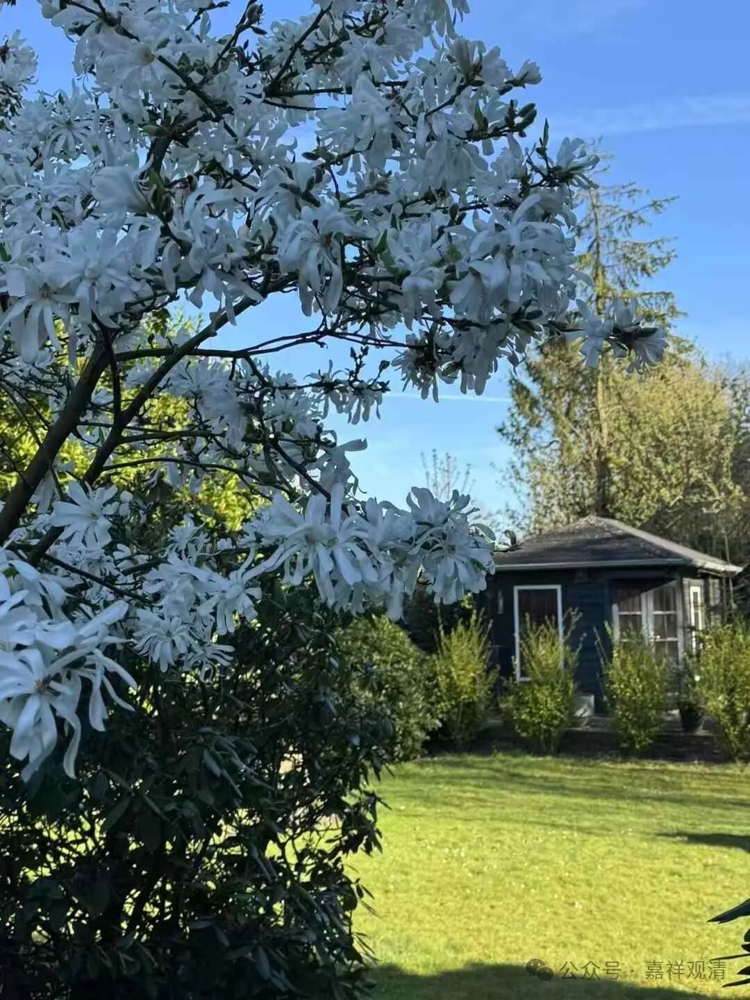

吉藏说的第三重二谛，是针对大乘人的。大乘宗人，已能理解《维摩诘经》等所说的“不二”之理，但由于实在没能通达真正的二谛，所以认识上仍旧有误。对此，吉藏祭出了第三种二谛，简单的理解，就是第二重二谛（“二”与“不二”）整个都算作是第三重的世俗谛，此“非二非不二”则是第三重的胜义谛。

再来解释一下，第二重的“二”，是第一重的“不离胜义的世俗”和“不离世俗的胜义”，第二重的“不二”的“不”，是指“无自性”，第二重的“不二”，就是指“二无自性”。那么，第三重的“非”的意思同于第二重的“不”，也是“无自性”的意思。

继续读《十二门论疏》：

“**第三重，‘二’‘不二’皆是因缘，由‘不二’故‘二’，由‘二’故‘不二’，故‘二’‘不二’并是因缘，名为世谛。“是则无自性”者，明由‘不二’有‘二’，‘二’无自性，是即‘非二’。由‘二’有‘不二’，‘无二’（应作‘不二’）无自性，故‘非不二’；非‘二’‘不二’，名为真谛。故从‘二不二’门入‘非二不二’理。** ”

呵呵，这一段，我都没见过句读正确的。来，解释一下。

“二”（相待的胜义、世俗）和“不二”（此二谛无自性）也是相待的因缘有（**‘二’‘不二’并是因缘** ），所以都是世俗谛；胜义谛呢，则是“非二非不二”（**非‘二’‘不二’，名为真谛** ）——“非二”，就是“二无自性”（**‘二’无自性，是即‘非二’** ）；“非不二”，就是“不二无自性”（**‘不二’无自性，故‘非不二’** ）！

这里和前面一样，吉藏大师都在手里扣了一个中观的颂子——“因缘所生法，是则无自性”，在《中论》里是“因缘所生法，我说即是空”，在《十二门论》里则是“众因缘生法，是则无自性”。吉藏抓住了关键点——观待有的就是世俗谛，无自性则是胜义谛。一般的聪明人、包括很多大乘师的理解，则是，“观待的是世俗谛，绝待的是胜义谛”，这就理解错了中观的二谛了！本来前面半句“观待的是世俗谛”是对的，但是他们加了后面半句以后，前面半句就一起错了。世间人的自性执，让这些顶级的大师们在看到“观待”以后，就以为对应的是“绝待”，其实中观师的“观待”，对应的是“观待（主语）无自性”！

所以吉藏才说，这第三重二谛针对的对象是大乘（的大）师。真正达到、理解到这一步，比前面的两重要难多了。

