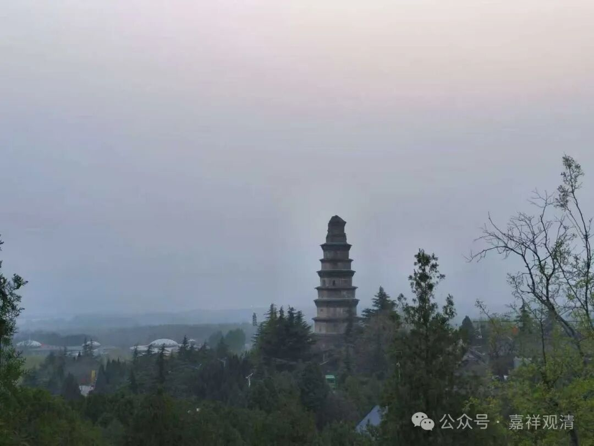
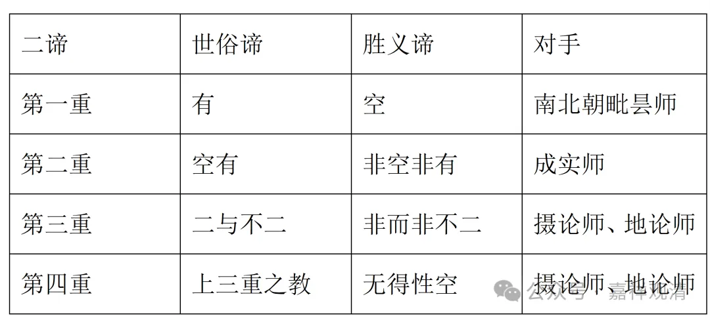

再看吉藏的第四重二谛。

吉藏《二谛论》：

“**四者，此三种二谛皆是教门，说此三门，为令悟不三，无所依得，始名为理。** ”

这一段文字和吉藏《中论疏》卷二全同，之前则不同。

这一段是说，前述三重二谛都是教说方便——罗什解释“世俗谛”有“言说”的意思，所以这里以前三重二谛为言说“教门”的世俗谛。胜义谛就是“不三”，按前面的造句，“不三”就是“三（重二谛）无自性”。作为胜义理智的所缘境，它是一种“无所依得”“不得之得”——胜义谛、胜义理智的所缘境是自性的无，是“胜义无”、是“胜义中有”。“胜义无”的意思是自性无，“胜义中有”的意思，是作为胜义理智的对境，它是存在。

我们再看一下表格，加深一下印象——

二谛

世俗谛

胜义谛

对手

第一重

有

空

南北朝毗昙师

第二重

空有

非空非有

成实师

第三重

二与不二

非二非不二

摄论师、地论师

第四重

上三重之教

无得性空

摄论师、地论师

好，我们继续拔高一下。

向来教界、学界对吉藏的“四重二谛说”都不乏溢美之词，但实际他在吉藏或者中观、三论宗的理论里属于可有可无的支分说、边角料。

前面我们说过，吉藏的“四重二谛说”都有其所破的时代的对手（见上表），是一种“对偏正”，而在这种“对偏正”的背后，才是吉藏真正的自宗——《中论》的“二谛说”，没有什么三重、四重，就是单纯的“缘起”“无自性”。

我们帮大家回过头再看吉藏《十二门论疏》中“四重二谛说”背后的伏笔：

“初重，‘**因緣所生法** ’為俗諦。‘**是即無自性** ’為真諦……

次重，‘**因緣所生法** ’此明若空若有皆是因緣……‘**是即無自性** ’明由空故有……

第三重，……故二不二並是**因緣名為世諦** ；‘**是則無自性** ’者明由不二有二……

第四重，二不二、非二非不二並是**因緣悉名世諦** ；**因緣無自性** 則無二不二亦無非二不二。”

我把它标出来了，大家看，实际吉藏在“四重二谛”的背后，不变的是“因缘为俗谛，无自性为真谛”！“四重二谛说”是方便、是套路、是技巧，是中观“二谛论”的运用，吉藏手里的核心武器就是单纯的《中观论》里的二谛。

吉藏在“四重二谛说”背后留了一个暗线，这在《十二门论疏》里面表现得比较明显，在《中论疏》和《二谛论》里面表现得不突出。

既然“四重二谛说”是一种“对偏正”，那就不是吉藏的核心观点，吉藏核心的二谛理论，还是“众因缘生法，是即无自性”，吉藏是用这个，对其他宗派的“二谛说”开刀的。“四重二谛说”，不是吉藏对龙树二谛论的“接着说”，而是“照着说”，不是发展，是运用。

