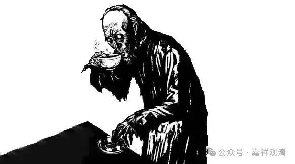

我是孔乙己吗？

——一个名字的几种写法

《缘生三十论》的作者，目前看到的有五种写法：1、欝楞迦；2、欝楞伽；3、鬱楞迦；4、鬱楞伽；5、鬱愣伽。

1、欝楞迦：历代大藏经的《缘生经（论）序》、《缘生论》、《大乘缘生论》，及《根本大和尚真跡策子等目錄》、安然《諸阿闍梨真言密教部類總錄》、《一切佛菩萨名集》、《古今图书集成选集》皆署名“圣者欝楞迦造”；

2、欝楞伽：《开元释教录》卷十二、《贞元录》卷五、卷二十二、《菩萨名经》卷八，作“圣者欝楞伽造”；

3、鬱楞迦：《贞元录》卷二十九、蔡念生《中华大藏经总目录》卷三、卷四作“圣者鬱楞迦造”。

4、鬱楞伽：《开元释教录》卷七、《贞元录》卷十、《续贞元录》卷一、《至元法宝勘同总录》、《阅藏知津》卷四十、蔡念生《中华大藏经总目录》作“圣者鬱楞伽造”。

5、鬱愣伽：《大藏经目录备考：<至元法宝勘同总录>藏文德格版北京版比较研究》作“鬱愣伽造”；

童玮《二十二种大藏经通检》还原“郁楞迦”为梵文，作Venerable Ullaǹghya。

……

不做无聊之事，何以遣有涯之生……

