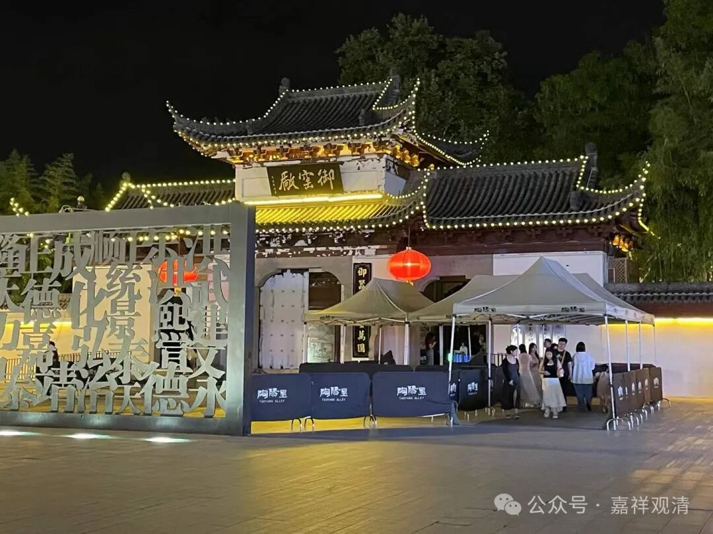

“異熟習氣為增上緣，感第八識，酬引業力恒相續故，立異熟名。”

这里的“增上缘”，大正藏版《三十论要释》原文为“增长缘”，应该是“增上缘”，增上缘前面讲过了，范围最宽的那个。

这个前面有两个习气，一个是等流习气、和异熟习气。异熟的习气种子，它作为增上缘呢，它感、生起这个第八识。

异熟习气感第八识，真正的有“异熟”的能力，而“酬引業力恒相續”。我们讲“业”的分类里，有一种分二，就是分为“引业”和“满业”，这里“酬引業力恒相續”，提到的就是二业里的“引业”，后面说感前六识是“满业”啊。

引业和满业，相当于什么呢？一般有这个说法，“引业”相当于画画，“满业”相当于填彩，这个是唯识当中经典的说法。引业，说引业让你去哪里呢？引业让你去六道，带你去六道的，这个是“引”“业”啊；“满业”是什么呢？满业的是，在六道当中，你的其他的情况啊，比如说你在人道享受快乐，这个是人道的满业，如果你在畜生道也可能享受这个很好的满业，这也是有可能的啊，但是你在人道当中也可能享受很差的满业啊，你上辈子呢做的好事，做那个好事呢，让你引发了什么呢？引发了人道的这个引业，就是你的引业是好的。满业呢，上辈子布施不怎么样啊，上辈子这个忍辱也不够，那这辈子又穷又丑，这个引发到人的就是引业，又穷又丑就是满业。

我们也碰到过是吧，有些人家有一个富豪，他们家一楼有养鱼啊，专门每一楼有一个佣人啊，有一个佣人专门有一件事情就是专门去养鱼的啊。这个鱼，引业不好，满业好。

也有引业很好，满业不好，索马里难民都算是引业好、满业不好的。

引业也不好，满业不好的，比如六六，比如被打得很惨的狗、比如地狱里大部分的众生。

引业也好，满业也好的，比如首富们算是吧。我也不知道啊，他的苦你们不知道啊，他的苦你们不知道，他们请不到我给他讲课对吧？所以你们应该感到很赚是吧？首富都请不到我，我都没在首富家住过，首富都没有这个福气，他都没有机会给我买过单、没机会请我吃素斋！哈哈……

这就是引业、满业。引业、满业不用再说了吧。

