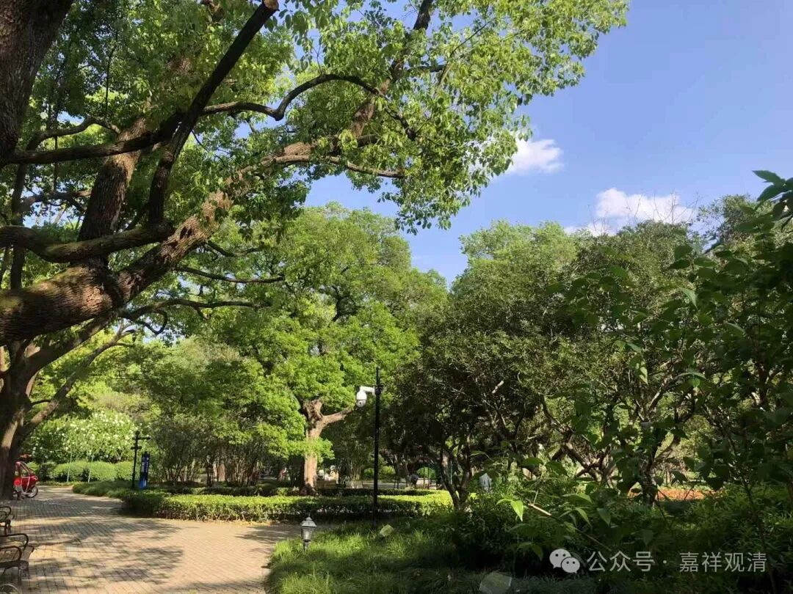

**“立異熟名，酬引業力恒相續故。”**

“立異熟名”，给了“异熟”这个名字。第八识主要“** 酬引業力**”，长时相续，安立了“异熟识”的名字。

第八识有一个名字叫“异熟识”，有人说很难理解，其实还可以啦，没有那么难，下面会说，实在不行就光记一个“第八识他又叫异熟识”就可以了。

第八识又叫异熟识，它是什么呢？接下去会讲了，因为只有他真正符合异类而熟、变异而熟、异时而熟，只有它都能够满足，而且它还有一个，它能够满足“相续”这个条件，能够没有间断，第八识没有间断。第八识没有间断，所以它才有这个名字，下面会专门讲。

这个第八识又叫异熟识，这个如果要展开呢，那我们来看啊，我们展开试试看啊，但实际上是没必要展开的，但是他们总是在这里要展开，我也头大，没办法。必须要往这里展开，因为反正是总有地方要展开，不在这里展开，就在那里展开，那我们就展开吧。

第八识呢……你们应该听说过《八识规矩颂》这个名词啊。一般很多人说《八识规矩颂》是玄奘法师写的，但是像我们这种资深唯识圈内的人，资深唯识圈内的人，就觉得这种说法很low啊。

只有那种编外唯识的人，那些现在佛学院绝大部分讲唯识的人啊，才讲这个《八识规矩颂》是玄奘法师写的啊，我们圈内的水平好的唯识师（当然也没几个），都知道这个不是玄奘法师写的。首先啊，玄奘法师翻译的，或者他的作品很明确啊，什么啊，73部啊，1335卷啊，它是非常明确的。

而且《八识规矩颂》，这里面有好几个地方是有错的啊。如果是玄奘法师的话，它不会有这样的错误啊，比如说三量啊，现量、比量、非量，莫名其妙啊，你不能说有三种人是吧？男人女人和非人，你不能放在人的分类里面啊对吧，非量你不能放在量的分类里面啊，这不对呀。

还有这个什么？“去后来先做主公”，意思没错啊，但是如果真的这么说的话，将会出现一个问题啊，就变成时间是在八识以外的更高级、更高阶的存在了啊。“去后来先做主公”，变成时间是一切背后的存在了。

