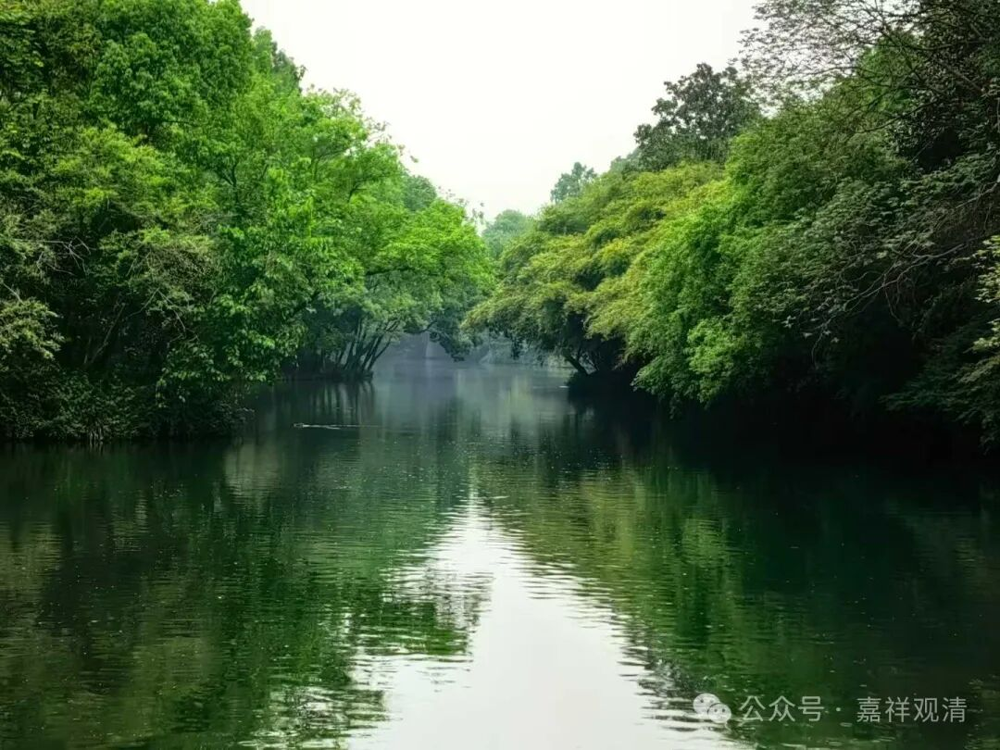

那么《八识规矩颂》，这里面有这几句，我们可以放在这里来讲啊，叫“不动地前才舍藏，金刚道后异熟空”

我们来看一下《八识规矩颂》的原文，是最后一颂：

“不动地前才舍藏，金刚道后异熟空，

大圆无垢同时发，普照十方尘刹中。”

“不动地前才舍藏”是什么意思呢？首先第八识又叫阿赖耶识。“阿赖耶”的意思就是这个藏，叫能藏、所藏、我爱执藏。

它“能”够“藏”什么？能够藏种子。所藏的是种子啊，第八识自身就是“能藏”。

能藏里面，这个里面“所”藏的什么？所藏的是种子。

然后“我爱执藏”。第七识为执第八识的见分为我，第七识它的作用是什么？我痴、我爱、我见、我慢！第七识唯独把第八识的见分执为我，或者把第八识执为我，这就是我爱执藏。

“阿赖耶”就是有“藏”的意思，它为什么叫“阿赖耶识”呢？因为它是能藏，有所藏，被我爱执藏。

“不动地”是什么呢，是大乘圣者的第八地。

第一地是什么？极喜地。见道了，欢喜。主修布施。

第二地离垢地，离犯戒垢染，主修持戒波罗蜜多。

第三地发光地，发智慧光，主修忍辱。

第四地焰慧地，主修精进。

第五地极难胜地，主修禅定。

第六地现前地，主修般若。

第七地远行地——因为第七地离前面马上就要证第八地了，他已经到了大海里面了一样啊，三大阿僧祇劫的前面两大阿僧祇劫就要过去了，比一开始登地已经很久了，所以叫远行地。主修方便波罗蜜多。

第八地不动地，主修愿波罗蜜多。

第九地善慧地，主修力波罗蜜多。

第十地法云地，主修智波罗蜜多。

到了不动地的时候，“藏识”这个名字，“阿赖耶识”这个名字就不用了，叫“不动地前才舍藏”，因为它的藏“我爱执藏”没有了，就不能再叫“藏”识了。

