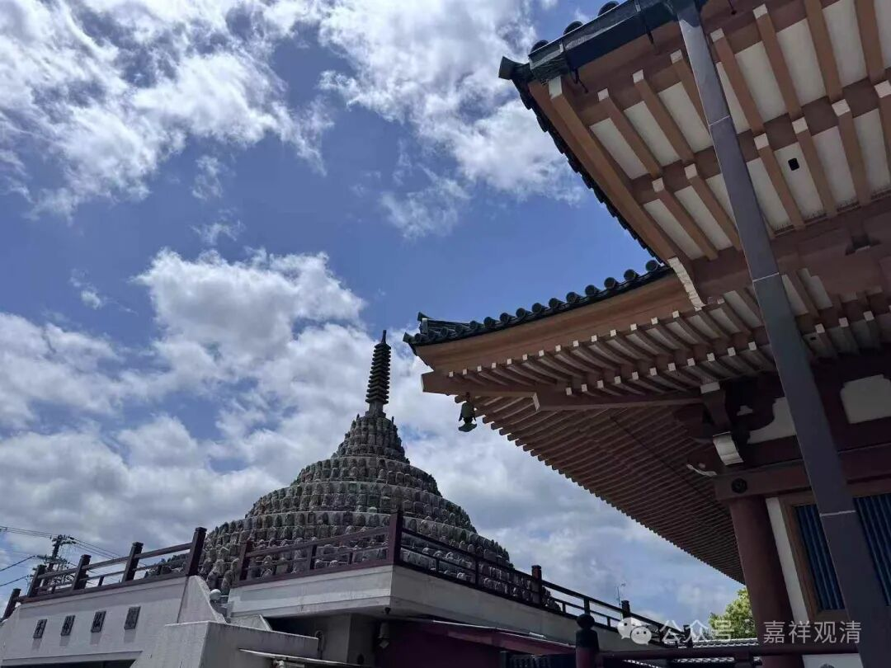

它（阿赖耶识）“是无覆无记”所摄的，善、恶、无记这三性当中，它是属于无记，无记当中，它是无覆，末那识是有覆无记。覆就是覆盖，指烦恼。

“觸等亦如是”，触等因为和这个阿赖耶识相应，所以既然它是相应的，它也要在这个时候也和无覆无记相应。

“恒轉如暴流”，这个是阿赖耶识的比喻。

然后“阿罗汉位舍”，阿赖耶识的名字，到“阿罗汉位”舍。三乘的阿罗汉位。《八识规矩颂》的是“不动地前才舍藏”。那么二乘阿罗汉位也是一样，到了阿罗汉的时候，他也是烦恼断尽了是吧？在唯识来说是阿罗汉烦恼障断尽了，人我执断尽了，在中观派也是啊。

断尽烦恼障，有些地方讲第七地啊，如果是讲第七地的话，是指的第七地的最后心。一定要讲全部断完的话，应该是第八地，第七地的最后心，是断最后的所有的烦恼障，到第八地，就相当于一个解脱道嘛。

“阿罗汉位舍”，阿罗汉，它如果证得阿罗汉以后，他的断烦恼的阶段，如果那大乘和罗汉来比的话，大致相当于第八地，所以在这个《八识规矩颂》里面提到“不动地前才舍藏”，“不动地前”也是一样，实际的意思是在入不动地的那个时候，那原先叫藏识的意思就没有了，藏识这个名字就不再用了。

能听懂吧？因为到第八地就已经断完了嘛，唯识和自续都说是断完现行，应成直接说断完了烦恼障。说“不动地前”，这个“前”其实是有点问题的，“不动地时正舍藏”，还差不多啊，它证得不动地的时候，藏识的名字就去除了，“不动地前”的“前”不够精确。

