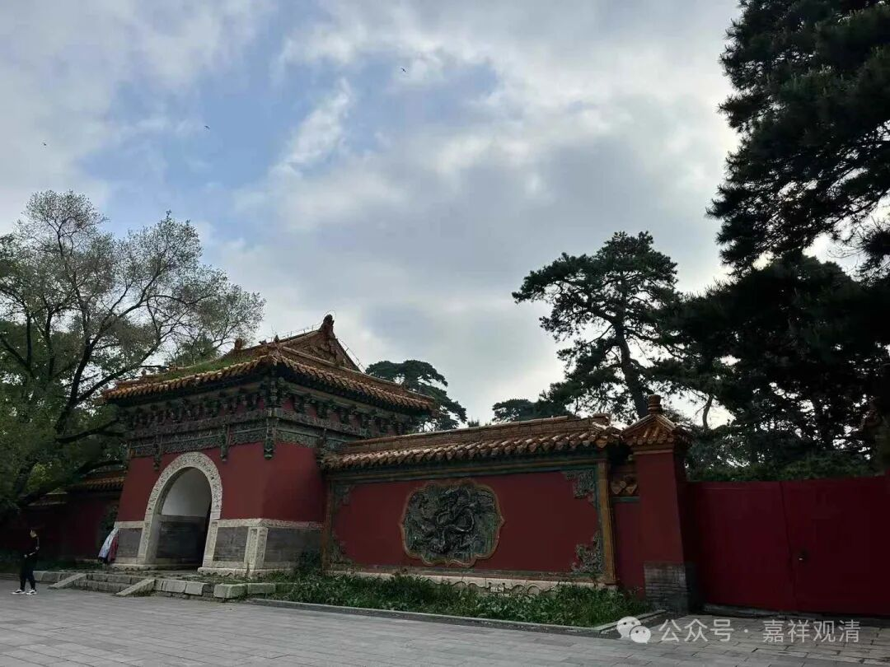

我们看一下《唯识三十论要释》和《成唯识论述记》在初能变科判的异同。

首先，第一个“初阿赖耶识”是“自相门”，这个一样啊；

第二、果相：謂“異熟”；

第三、因相：謂“一切種”；这个都一样。

接下去不一样了，差别有点大了。

《成唯识论述记》把第四、所緣：謂“執受處”。第五、行相：謂“了”。把“不可知”者，单列，“不可知”单列了，这个有点特别，《成唯识论述记》说“若別開者，束五受門相應中攝，俱心所故。”这个“不可知”有点特殊，安慧和护法在这上面差异极大，我们到后面有机会再说。《要释》把这两个合在一起算一个——“所缘行相门”。不过即使这样，《要释》和《成唯识论述记》的区别仍旧只能算是在护法系内部的小小差别而已。

《述记》第六个是心所相应：謂“常與觸作意，受想思相應”，这个《要释》也一样；

《述记》第七是五受相应门：謂“相應唯捨受”，《要释》没差别。“一‘相應’言通二處也”，意思是“相应”这个词要用两次，通两个科判——就是“常與觸作意，受想思相應”、“相應唯捨受”。

《述记》第八是三性，《要释》作“三性分别门”，解释“是無覆無記”，两者也没啥别。

第九个“恒轉如暴流”是因果譬喻门。

第十个是伏断位次：謂“阿羅漢位捨”。

这里面有一句不一样的，就是关于对“觸等亦如是”的解读。《要释》单独给一个科判，叫“心所例王门”，意思是，触等五遍行和阿赖耶识一样也是无覆无记。

《述记》没有给单独的科判，认为固然这一句“触等亦如是”的意思确实是“心所例王”，但这里在讲第八识，心所插进来属于跑题，“**俱時心所例同於王，非是分别第八識也** ”，说这个“心所例王”不应该放在十门当中。

两个人说的都有道理。

那么我们来看一下啊，你们手上有这个书吧，有这个书看起一就方便一些，我们来看它们两个的差别。

这个《成唯识论》这段的科判叫“八段十义”，“八段”“十义”是两种不同的科判，和《要释》的说法不一样，但可以互相参考。到底怎么说它和《唯识三十颂要释》不一样，其实差别也不大……这里简单让大家稍微知道一下。其实这段不讲也完全没什么问题，只是这么一说啊，总要加点东西。

