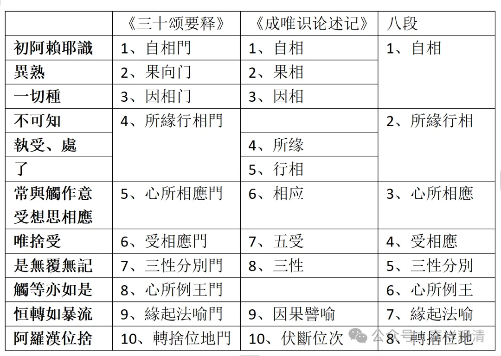

……我们看到后面的八段也很明显，八段，你看前面三个拼在一起作为“自相”可能是最得原意的安排。接下来合并“所缘”“行相”的话，可以发现这个八段的科判和《唯识三十颂要释》基本是一样的。

前面说起过，昙旷，是圆测法师是门下的，这个科判可能是圆测法师系统的安立。

那么《成唯识论述记》和这个圆测法师的科判不同，在这里面他提出了一个问题，就是他觉得“触等亦如是”，“触等”属于心所，而现在说的是初能变阿赖耶识，“触等”它不是阿赖耶识，就把它踢掉，不算在科判里。但是这样一来，把颂文当中的一段完全不算在里面、不解释也有麻烦，影响到了《唯识三十论》的完整性和权威性……我们从这个《述记》的“八段”来看，很明显地《述记》也认为“心所例王”这个单列一个科判也是可以主张的。

其实回应《述记》也可以很简单啊，你一定要说“触等亦如是”这一段不是阿赖耶识，那对方可以说“我不是一定‘只’讲阿赖耶识的，我是在讲这个颂子，主要讲阿赖耶识，顺带讲其他的。”这样说也说得过去，对吧，“我在讲这个颂子，不单只讲阿赖耶识，和阿赖耶识有关的也一起谈……”。

