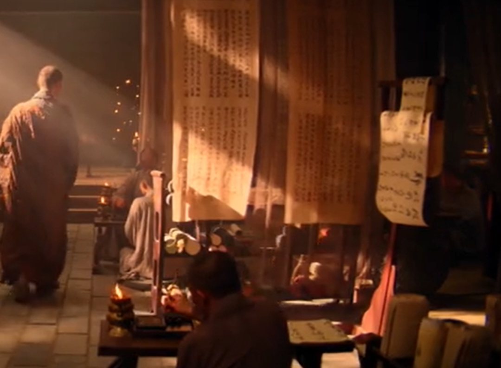
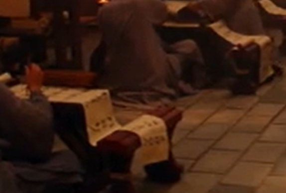

“（離此，）**餘法能遍執持勝異熟果不可得故。** ”

（离了这个异熟识）……

这里的“**餘法能遍執持** ”这几个字，在《成唯识论》里则是：“**命根、眾同分等，恒時相續** ”。应该《成唯识论》是对的。这里的“餘法能遍執持”，我觉得可能是抄错了。它抄到下面“一切种子识”那里去了，抄到后面去了，看见没有？后面“一切种子识”这里才是“**離此，餘法能遍執持** 諸法種子**不可得故** 。”

我数了一下，好像这两段前后是差了51个字，那就正好抄错三行，唐代标准的写经一般是17个字一行，它（敦煌本《要释》）抄错了三行，51个字正好三行。

写经，包括大部分的雕版印刷的藏经，一般的格式、规矩的话，一般是17个字一行。这个是有规矩的啊。我们这个看黄晓明演的《大唐玄奘》那个电影，最后玄奘法师翻译啊，一张纸写几个字，一行三五个字，这又不是书法创作，当年如果真敢这样，虽然不至于要枪毙、炮决，但是少说也要被打一顿啊。

抄写经典，特别是皇家、官方的写经不能随便抄的，拿着一卷纸竖过来写，不知道哪个大聪明想出来的？誊写了以后还放那里晒……搞什么呀这个？不可以啊，有规矩的啊。每一行17个字，你如果抄错的话，有专门的人检查的，抄错要作废、要重抄的。把那一卷纸张竖过来抄写，除了《大唐玄奘》的导演和那些文盲监制，应该是没人会有那样奇葩的思路……

当然要感谢黄晓明出演《大唐玄奘》，不然这电影肯定进不了院线排片，我还去贡献了票房……但是，监制导演编剧这帮人真的除了专业也真没啥文化，请的佛学顾问大概除了能上早晚课也都是啥也不懂的……

