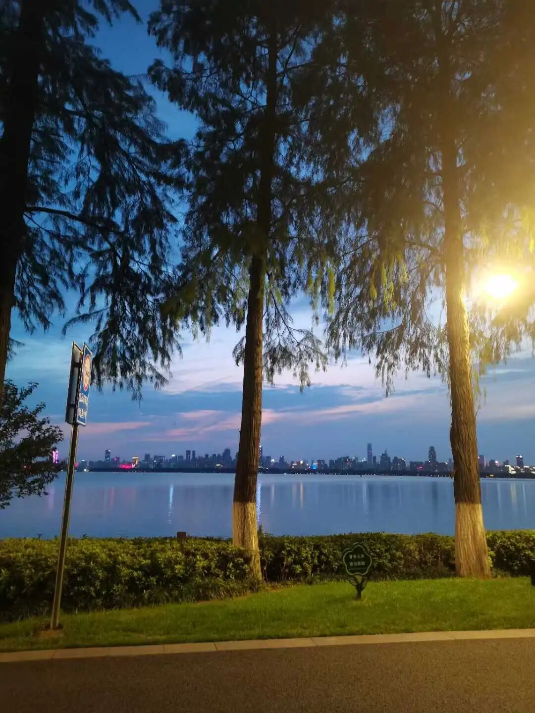

这个其实是一个问题。包括今天我们很多人在批评这个教材，那个教材。说实话，应该说编教材的人不见得这些不知道，但是实际来说，不妨大家先学起来再说。其实你看啊，我们小时候学的东西，其实知识的内容本身也未见的就是最重要的，我举我一个表弟的例子好了。

我一个表弟，小学的时候读书极差，我们眼里觉得基本就是废物了，但是到了初中呢，慢慢就跟上来一点，虽然不算好，但是跟上来一点，提高一点了。什么情况呢？其实你在小时候的教材里抠的很细的时候，后来其实可以有很多新知识可以绕过的，你长大了很多东西都可以引发“侧枝循环”的……

开始学的时候你会有问题，但是你坚持下去，把后面的知识继续吃下去……甚至你在后面学着学着，你把前面的也搞懂了，也正常。

所以五大部这些学习也是一样的，觉得你到后面到了学中观的时候，有些你在因明班辩的那些一直没搞懂的问题，到了中观班，也能跟得上，没问题……

学习上两个方向，要取其中道，也是很难的，一种呢，“务求精实”，一种呢，“观其大略”。这两种找到一个平衡，很难。

三国时候，诸葛亮和徐庶他们一起玩，“与石广元、徐元直、孟公威俱游学,三人务于精熟，而亮独观其大略。”

其实“务求精实”，和“观其大略”，学习过程中是都需要的。首先有些东西就是该死背的，该背的确实要背啊，我们小时候数学一二三，我们小时候写字这些都是，都是刻意的，要把它背下来的，这个字怎么写，都必须要背是吧？就是努力的背。

另外，像诸葛亮的“观其大略”，陶渊明的“不求甚解”，这种“大而化之”“上帝视角”也是在知识积累到一定时候需要的“视角”。

最好的学习呢，是这两种应该要同时具备或者是要走“中道”啊。任何偏向一方都是会有点问题的。

那么中国的后期的佛教就是偏向于什么呢？偏向于“装大头”，本来都是低级知识分子，装，说“我只要理解意思，我要悟”……知识都不够悟个P啊！这些人基础的佛教知识、阿毗达磨都不学，严格点的话算不算佛教徒都是问题。

另外一方面呢，就是阿毗达磨都学了，各种像唯识法相，这个我说的是顶尖高手啊，顶尖高手学了以后呢，不会说人话了，讲一个论典，就是能够把复杂问题更复杂化……在别人看不出东西的问题的地方，你看出问题，你写出东西很重要，这确实是个本事，但是你向下兼容的时候，你也要注意……这个呢？不是说我没有这个问题，我也有这个问题。

