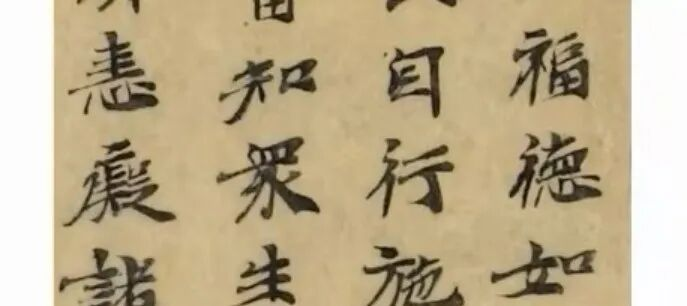
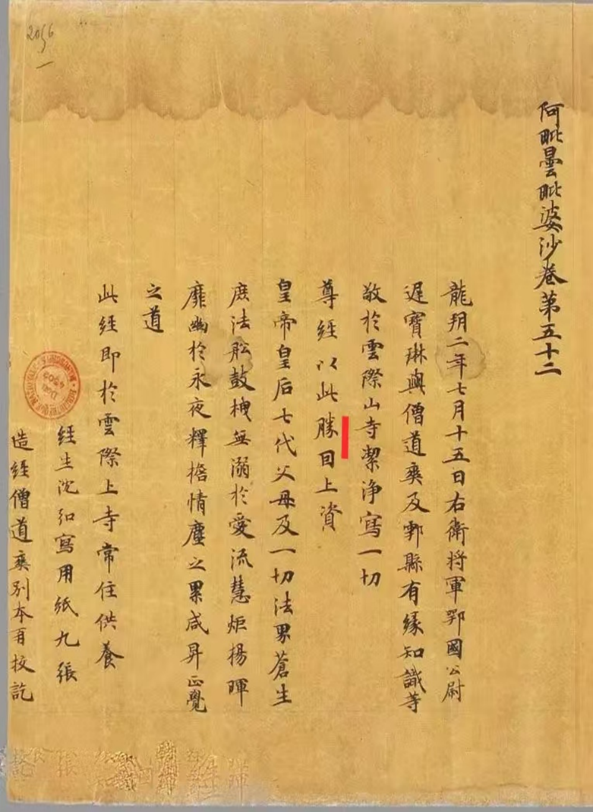

《唯识三十颂要释》讲义·006·001

继续啊！《唯识三十颂要释》……

我们看一下敦煌本的文献。

因为我们的《唯识三十论要释》在敦煌本当中，上次讲到“一切种是因相”，敦煌本当中这个“因”，和“目”和“自”都很接近，我们看一下。

这两段都是敦煌本的写经。

我给大家稍微看一下，可以看出来，这个字确实看起来像“自”，但实际确实“因”，整理的人不注意的话、不是专门学书法的话就可能会抄错。

当时那些做《大正藏》校对、句读的人很多就是当时的一些日本的研究生等等，你让他们看这个写经来录入的话，一般不是专门学书法的确实分不清。

所以这里面看见没有：“由能執持此種子故，名‘一切種’，是為因相”。这个“因相”，《三十颂要释》作“自相”。《大正藏》里面写的是为“自相”啊，这个确实，在外行看来，“因”和“自”太接近了。我们还是改正，“因相”。

他们读错了很正常，把这个“因”读为“自”，那很正常啊，但确实不是自相，“自相”在最前面，阿赖耶识属于是自相。这个阿赖耶识是自相，我们这里是因相。这个看见没有？嗯，没问题了吧？

我们顺便拿出来说一下。

