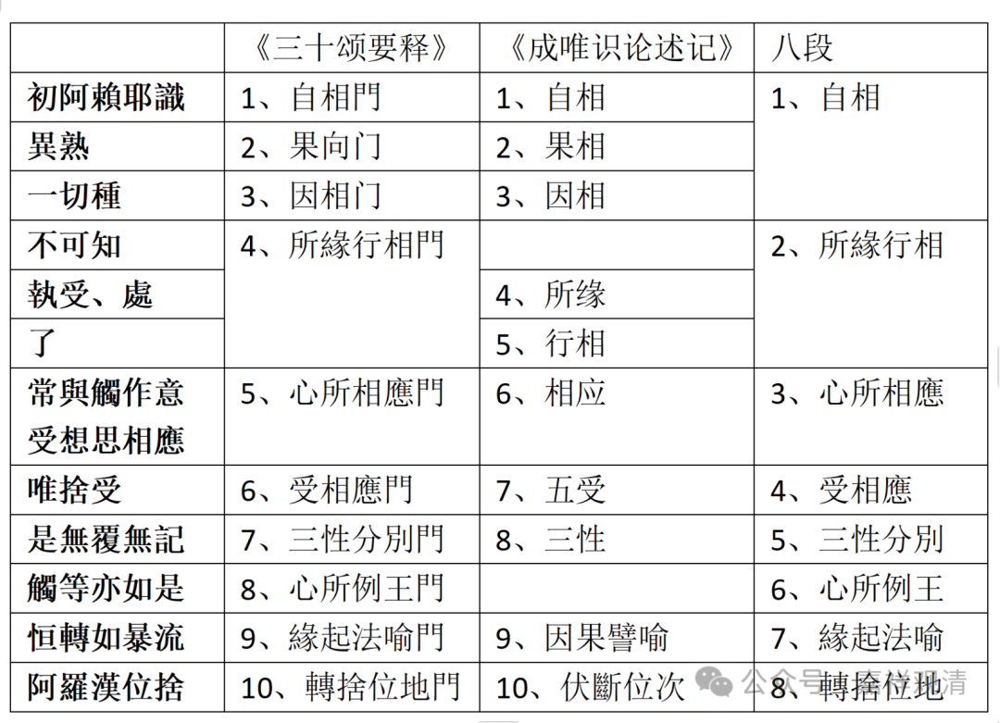

好，这里就是前面三个啊，自相、果相和因相。我们注意一下啊，这个要记住，接下来会提到。

这个表格啊在接下来有用啊，很重要，现在我们就是把它的自相、果相和因相讲完了。

 下面就是第四“所缘行相门”。

“所缘行相门”比较复杂的，就是它应该怎么细分的问题。大而化之就很简单，仔细追究的话就会复杂无比。

在颂文当中这句“不可知执受处了”。但是解释的时候呢，反而是感觉《三十颂要释》的这个说法更加简单一点，甚至有可能是论主（世亲）原意——有些事情可能作者考虑得也没有那么复杂。至于《成唯识论》和《述记》也都讲了，但比较复杂，相当复杂。

《述记》说虽然复杂，但是比较来看呢，他考虑的确实也比较全面——这个“不可知执受处了”确实要分三个更好，而这个“不可知”，确实如《述记》而言，要单独列一个，这样的解释更完美。“执受处了”和“不可知”，这个“不可知”单独要放一个，所以这里表格里给它单独空着。

然后，“执受、处”，是它的所缘；“了”，是指的行相，这个什么行相呢？行相是指的阿赖耶识的行相，或者说识的行相。

现在讲是“所缘行相门”。

那么《成唯识论述记》，把它分为叫所缘和行相两个。“不可知”呢，实际上是单独列的。这么解释（护法的解释），优于安慧的解释。安慧在这里解释为阿赖耶识对他的“所缘”和“行相”“不可知”，那样就出现了一个大问题，迅速地被中观派找到了破绽——中观派问：如果你的阿赖耶识对他的“所缘”“行相”“不可知”，那阿赖耶识就只能是非量！如果他是非量的话，那他以上的一切认知岂不都变成了错乱？！

所以，关于《唯识三十颂》这里阿赖耶识“不可知”的解释，护法的远优于安慧，安慧的说法基本上被中观一招秒了……

