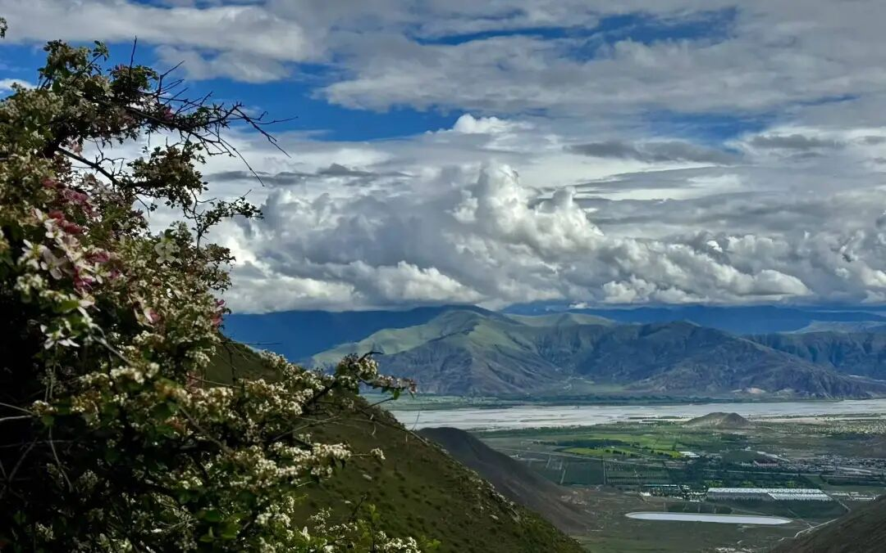

我们继续啊。

“**而相相似，處所無異，** ”还在那个地方。

“**如眾燈明，各遍似一。** ”这个顾老以前也是用的这个比喻啊，这个比喻可能很好。

我的意思是什么呢？比如说看到说“万法唯识”“一切唯心造”，大家都会问，如果你说外境是共相所成的假相，说实际所谓的外境是由大家每个人的自己的识变的，那现在世界上不停地有人死，不停地有人生，那人在变化，外境不也应该是不停在变动吗？但感觉外境不是这样不稳定的变化的样子啊？

“如眾燈明，各遍似一”，就是回答这个的。它是什么呢？顾老的比方是这样啊，比如说你开100盏灯，现在换了两盏，你也看不出来，你感觉灯还是一样亮，再加两盏，你也觉得是一样的亮，实际上确实是有变化，但是你基本上看不出来。

那么现在呢？确实不停地有人死了，有人生了，那按理来说，这个“共相”它应该有变化是吧？但实际上，它的变化极小，我们的这个分辨的能力，分辨不出来。“如眾燈明，各遍似一。”差不多，这里面也可以这样理解啊。

如果简单一点解释的话，就是“好像所有的灯都打开了，然后照出来的样子都是那样一样。”但是我觉得这个“如眾燈明，各遍似一。”可能顾老的用于解释外面的这个境它的变换，和各别人的死、生的关系，这个比喻可能在那里更好一点。我个人觉得在唯识当中那样可能更好一点，顾老的这个比喻能够理解吧。

这个拿来解释佛教说的世界毁灭就挺简单的。佛教说，将来有大三灾：水灾、火灾、风灾，然后从我们的欲界一直到三禅最后都消失了……这个三灾，水灾，初禅（含）以下消失了；火灾，二禅（含）以下消失了；风灾，三禅（含）以下消失了……最后就剩下四禅以上了……

这个消失了，是怎么消失的呢？对唯识而言非常简单，比如说初禅的众生没有了，初禅的世界就没有了吧；二禅的众生没有了，二禅的世界也就没有了；三禅的众生没有了，三禅的世界也就没有了——这是最简单的，能理解吧。所以大三灾实际不是坏事，说起来叫“灾”，实际是，大家境界提升了，都不在这部分世界了，这部分世界就不存在了……唯识解释这个倒挺方便的，这里面众生因为境界都提高了，都“飞升”了；这里众生没有了，这部分世界就不存在了。

