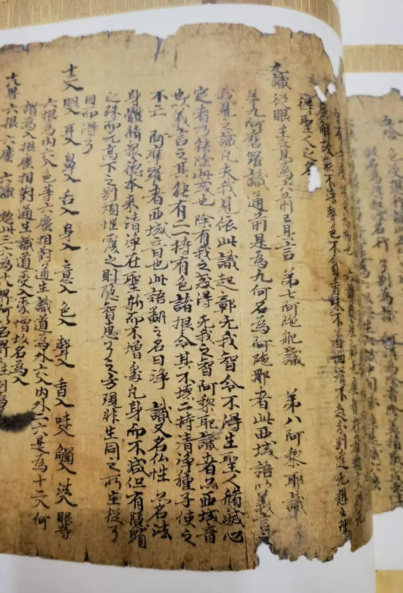
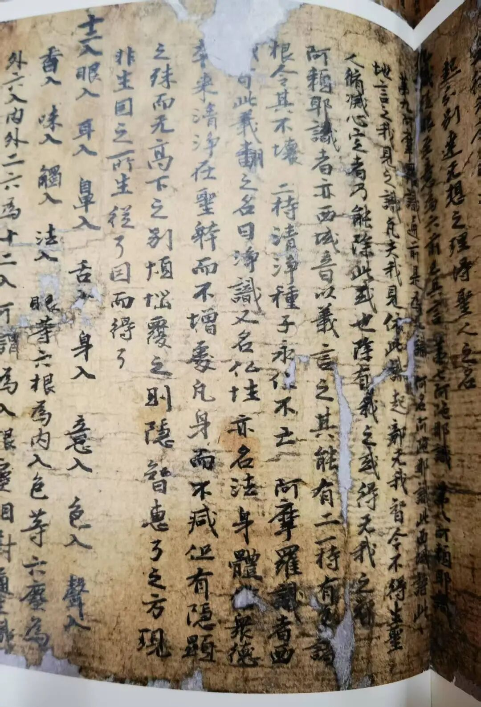

“**無漏法種，雖依附此識，而非此性攝故，非此所緣；雖非所緣，而不相離，如真如性不違唯識** 。”

无漏法解脱的种子，“雖依附此識，而非此性攝故”，无漏法的种子，依附此第八识，但不属于第八识所摄。为什么呢？性质不同——一个是杂染的，一个是无漏的。

“非此所缘”，也就是无漏种子不是阿赖耶识所缘，这个意思是什么呢？他说，阿赖耶识啊，是带着杂染的，或者说是可染可净的。既然阿赖耶识是可染可净的，它就不能是无漏清净的。由于它不是纯净的，所以它就不能持纯的无漏种——无漏种子、解脱的种子。第八识本身不是解脱的，如果它就是解脱的话，那我们不用修行了，因为我们都有第八识，都是本质解脱。所以唯识派说阿赖耶识不能持无漏种。

那么无漏种在哪里呢？它不能没有所依啊！但是又没有其他地方可以持，前六识不行，有中断；第七识不行，纯染污。所以它只能和第八识相关，所以，唯识派说无漏中就依附这个第八识，是依附在这第八识上，但是不是第八识所摄，也不是第八识所缘。

但唯识派里面有的人认为，第八识既然不能摄持无漏种，那就得让其它的来摄持，于是说“那就是第九阿摩罗识，无垢识”……敦煌文献里有不少这一系的说法，应该是真谛法师这一系统的说法。

真谛法师，一般说是安慧大师的直接弟子，但目前看起来，安慧似乎没有这个说法。

真谛大师译的《决定藏论》里说：

“……阿羅耶識是無常、是有漏法；阿摩羅識是常、是無漏法。得真如境道故證阿摩羅識。

阿羅耶識為麁惡苦果之所追逐，阿摩羅識無有一切麁惡苦果。

阿羅耶識而是一切煩惱根本，不為聖道而作根本；阿摩羅識亦復不為煩惱根本，但為聖道得道得作根本。

阿摩羅識作聖道依因，不作生因……”

这里的“阿羅耶識”就是后来翻译的阿赖耶识，“阿摩羅識”就是净识，后来译为无垢识。

