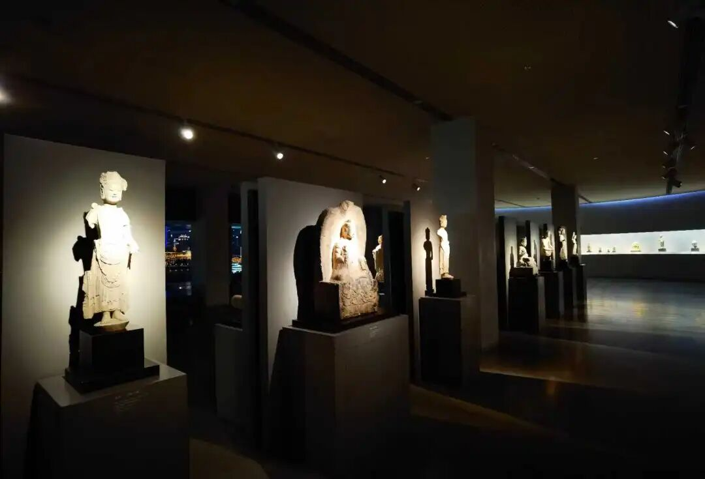

还有一个历史唯物地理解角度呢，就是“本有种子”这个说法呢，其实更接近于印度成书的的种姓制度，“你这种姓是天生的，你不可能新熏，不可能逆天改命，你就认命吧！”，所以印度人比较容易接受这个本有种子。

中国人一般不容易接受这个解脱种子“本有”这个观点，中国人都是“我亦可以为尧舜”、“王侯将相宁有种乎？”，至少对中国的知识阶层而言，“难以跨越的修行阶层”这不符合他们的修道“理想”，所以，达摩来了中国以后才会感慨，“震旦有大乘气象”。

我们中国人（大部分）不接受“本有说”，不接受种姓制度，也不接受“五种性”说，我们认为，所谓的“无始以来”，那只是时间长到难以追溯而已，哪有什么“出厂设置”的修行根器，印度人才认同“种姓制度”这种出厂设置，我们不认为出厂设置合理，认为解脱主要是靠闻熏习啊。所以民国时期我们的支那内学院，杨仁山、欧阳竟无、吕澄先生他们的那个支那内学院，就非常强调“闻熏习”啊。

为什么支那内学院会特别强调“闻熏习”呢？其实也是针对当时的汉地佛教的流弊了，汉地佛教早就就不强调学习了（就是不“闻熏习”），不强调学习，连基础都不学，“只管念佛”、“只管打坐”，都要去在那里坐，大家都学佛他老人家，而且之学最后一招——到大树下面打坐，最好一坐就都开悟了，什么都会了。这种修行观影响到了佛教的基础了，动摇了佛教的基础，所以支那内学院非常强调这个“闻熏习”。

        修改于