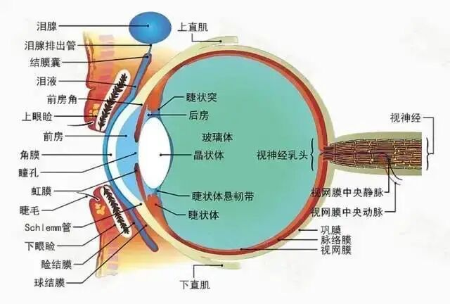

好，这一段说执受什么呢？执受的是执种子，这个种子是什么呢？是指的有漏法种，不算无漏法种。无漏法种不是阿赖耶识所能够摄持的，无漏种子是附在阿赖耶识上，因为它也没有其他地方可附是吧？能够理解吧。它总不能附在前六识上，也不能附在第七识上。前六识有间断的，第七识虽然恒，但是它只有我痴、我见、我爱、我慢这个功能，所以它不能去持这个无漏法种，那怎么办呢？只能给第八识，因为他又没有安立第九识是吧？只能给第八识，但是它又和第八识不是完全相应，或者第八识持不了它，所以它只能说是附，到底怎么个附法？讲不清楚，唯识只讲到这个地步，但是就是附。

对话：听不清……

回答：……这个阿摩罗识确实是跟“佛性”“如来藏”有关系。

问：……

护法说，无漏种子应该是本有的，但并不排斥新熏，他的说法是熏了以后，这个无漏种子增长，所以一个叫本性住种姓，一个叫习所成种姓、随增种姓，两个都有。

好，我们继续。

“‘有根身’者，謂諸色根及根依處，”

“色根”就是“有色根”啊，眼、耳、鼻、舌、身根，前五识是有色根。

“根依处”什么呢？“根依处”实际上是“扶尘根”嘛？熊十力先生管“扶尘根”叫“扶根尘”，这个说法还挺不错的。

一般我们讲“有色根”就是前五根，比如那眼根来说，眼根是什么？眼根是“清净色为体”，是一种殊胜的物质、特别的物质，因为它能够见外面的色啊，所以叫特别的色。

在南传的、包括中观的传说中，眼根就有点像我们讲，我们讲的这个视神经在眼球里的这个出口——视乳头。就是眼睛的这个瞳孔再里面里面——眼科医生可以通过我们的瞳孔看进去，检查这个视神经的出口……

这个东西，部分佛教的宗派说它像针尖一样，或者是像麦芒一样啊，麦子的尖尖一样，很小很小的一个。这个真厉害啊，看上去这个，这个当年佛也好，或者这些罗汉也好，是真的有神通啊，这些这么微细的生理学的这个构造，还是在我们的眼睛里面的，这个视乳头的那个地方，他们能看到，厉害！我不知道怎么看到的，只能理解为他们确实有神通……

这个才是眼根。

按照唯识或者有部的这个讲法，眼根是我们肉眼看不到的，要用天眼才能看到……

有些人（章太炎）说，它就是视神经，这个不够精确……但我们就先不管了。

“有色根”是很微细的这个色，不是我们现在所讲的这些眼球啊、鼻子啊、耳朵呀、包括鼓膜啊等等这些，这些眼球啊、鼻子啊、耳朵呀、包括鼓膜……这些最多叫“根依处”，也就是“扶根尘”。

佛教说的实际上的眼根是指那个“胜义根”，“清净色”的这个“有色根”。

熊十力先生说，这个“扶尘根”是什么呢？是帮助（“扶”）这个胜义“根”的这些物质（尘），那“扶根尘”就基本相当于我们现在大家所讲的眼睛啊、耳朵啊等等。

所以一个是微细的胜义根、有色根，一个是实际属于身根的“扶尘根”，“扶根尘”是谁讲的呢？是熊十力先生。

