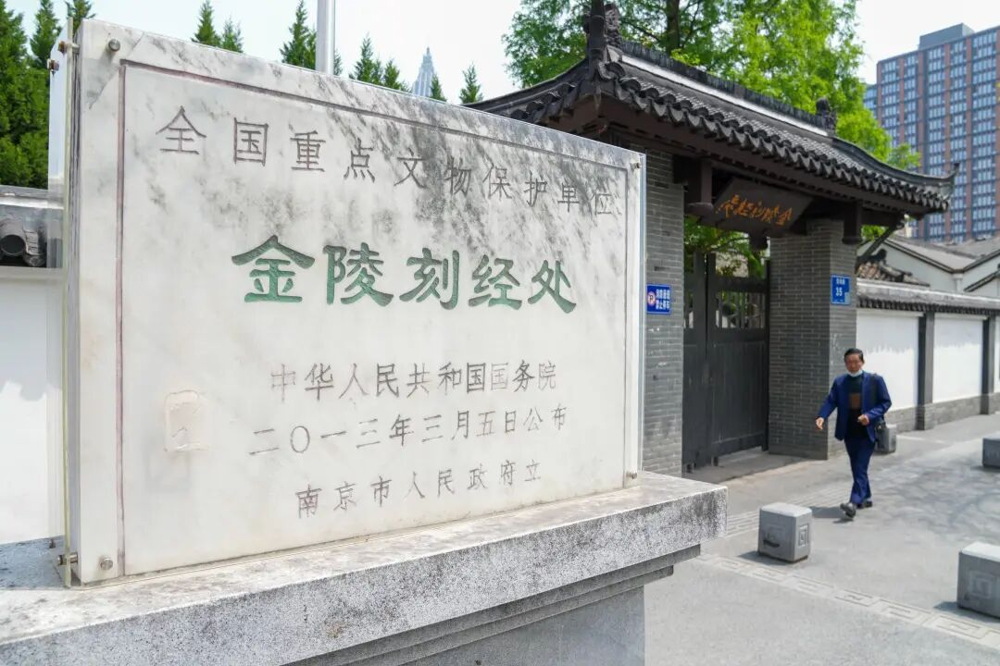
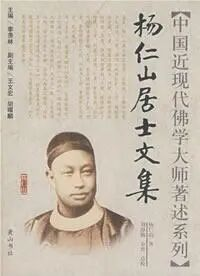
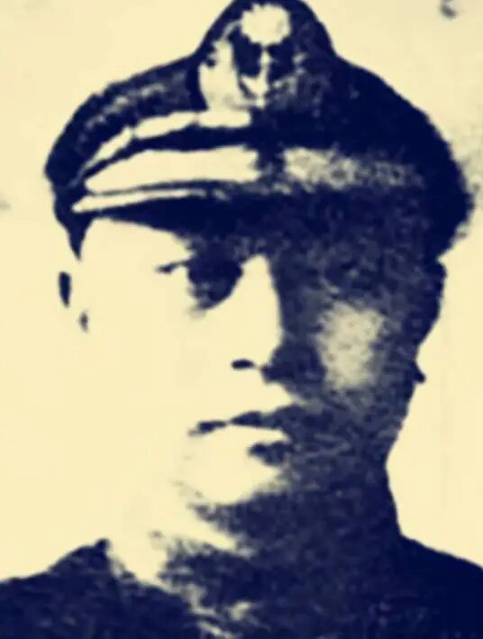
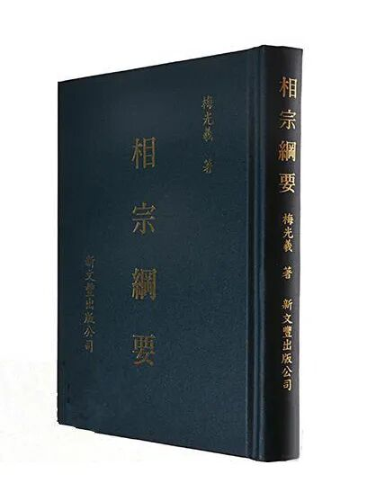
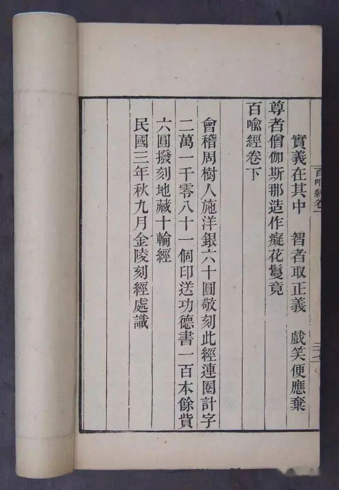

金陵刻经处、内学院的第一代杨仁山、第二代欧阳竟无其实也都是大佬。

杨仁山先生先在曾国藩幕府，后随曾纪泽在英国做过外交官，在那里结识了日本的南条文雄，相约互通有无，请回了很多当时国内失传的佛教典籍，后来创办了金陵刻经处，继而又发展出了支那内学院。

欧阳渐的大儿子在民国是著名的海军将领……后来被蒋介石毙了，欧阳格之死和马当要塞失守有关啊，然后他没有把那个海军放出去打，把海军都收回来了，蒋介石就把他抓起来，后来也是仓促地给毙了，陈铭枢、吴稚晖这些国民党高层都去营救啊，人家是不听……

当时欧阳格的意思是什么呢？欧阳竟无大儿子他的意思是我这里我的海军一共就这点鱼雷舰，我要都放出去，被人家飞机一冲、一炸、一打就全没了……所以我不能打，得收着打，一打的话中国我们的海军全没了……当时马当要塞失守过快，正好需要找替罪羊啊，毙了一个师长，又毙了一个欧阳格，但另外一个没有毙啊，一个军长没有毙……坊间还有其他的传说，说什么呢？说因为欧阳竟无大儿子欧阳格长得比较帅，跟啥啥八卦的事情太多了……

民国时候，还有梅光曦，又作梅光義，也是学唯识的，有唯识专著多种，如《相宗纲要》《义林章唯识章注》等，他支持金陵刻经处和支那内学院，一度和鲁迅是同事，后来做到财政部长，给鲁迅推销过金陵刻经处刻印的佛经，鲁迅后来就出资雕印了一版《百喻经》。

那时候，金陵刻经处和支那内学院都很有名，梁启超、梁漱溟、汤用彤都专门去“参学”过，汤用彤和熊十力关系也不错，好象是《汉魏两晋南北朝佛教史》里有一段《鸠摩罗什赠慧远偈》，汤就用了熊的解释，全文照录——好象是汤向熊专门约稿的……

