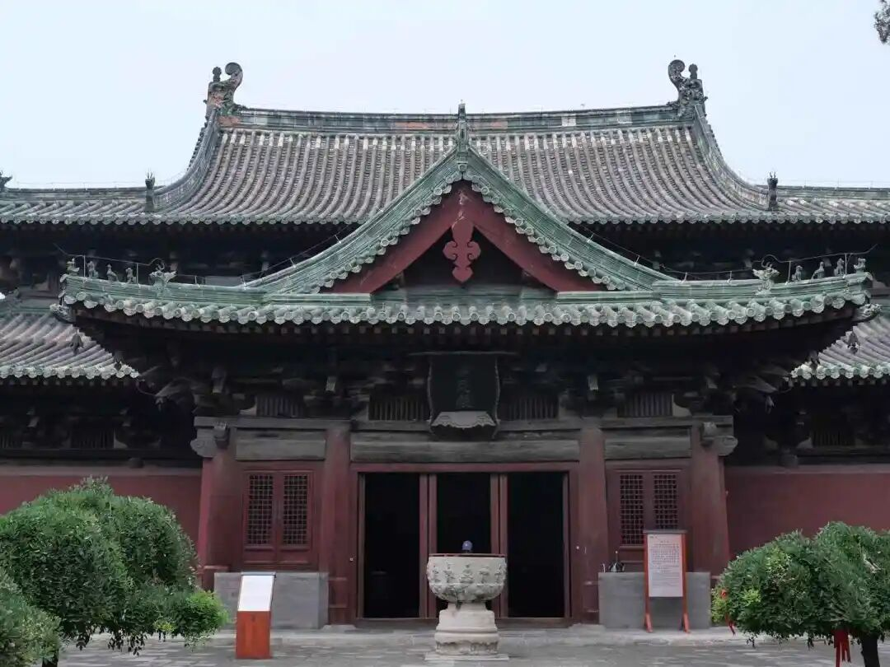

“**又此相應受，唯是異熟，隨先引業轉，不待現緣，任善惡業勢力轉故，唯是捨受。苦樂二受是異熟生，非真異熟，待現緣故，非此相應。** ”

阿赖耶识相应的受，唯独是异熟的、非苦乐的，它是基于之前的引业而转（转就是生起），“**不待現緣** ”，不待現緣是什么呢？它跟你现在看到的环境没关系的，它是什么呢？是之前的引业所生起的。引业所得的那个种子所生起的，它是异时的相应，所以它跟你现在所遇到的环境比如烫不烫啊等等都没关系，你烫了，你只能够前六识去接受，前六识是可以接受现在环境的反馈的，是吧？前五识也好、第六意识也好，都可以接受“现缘”，可以直接对现实世界给予反馈，但阿赖耶识不管的。

阿赖耶识相应的受不是现在的这些条件所引发的，它是“**隨先引業** ”而生起的。

“**任善惡業勢力轉故，唯是捨受** ”，你外面的这个情况和它内部的这个种子生起的这个阿赖耶识的这个受无关。阿赖耶识的这个受是之前的善、恶业引发的这个异熟。“因是善恶，果是无记”，第八识是无记的啊，“**唯是捨受** ”。

“**苦樂二受是異熟生，非真異熟** ”，另外呢，阿赖耶识呢是真异熟，是善、恶的势力生起的引业而升起的，这个叫无记，“因是善恶，果是无记”。那么苦乐二受是什么呢？苦乐二受是“**待现缘** ”的。

“**待現緣故，非此相應** 。”苦乐二受是第八识所生起的，叫“**异熟生非真异熟** 。”为什么不是第六识呢？前面讲过了，它有一个什么情况呢？第八识没有间断，虽然它异类、变异、异时而熟，但是它第六识是有间断的，所以它不符合唯识的这个“异熟”的定义，唯识在异熟上强调需要符合恒时相续。

同时这个“异熟生”呢，又是“**待现缘** ”的，我们现在的这些环境生起了以后才会有前六识对这个生起苦乐二受的感觉。那第八识呢，“**唯是異熟，隨先引業轉，不待現緣** ”，它是不待现缘的。

“**非此相應。** ”所以苦乐二受和阿赖耶识是不相应的。所以阿赖耶识唯独有舍受。

