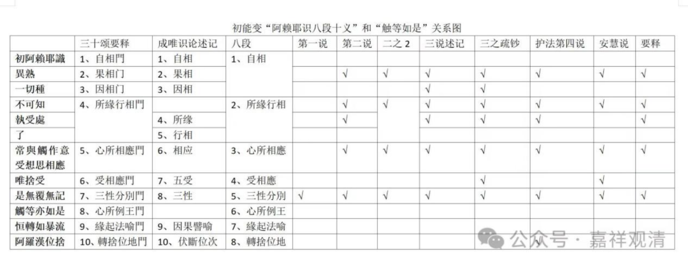

《唯识三十颂要释》，本来明天《唯识三十颂要释》，那就放到今天讲，而且现在我们这个进度，稍微有点慢，其实我们这可以加快一点啊。也是可以再加一节课，看看每天加一节课。

那我们先看这个颂子啊。先看这个颂子，那来看一下啊。

“**初阿賴耶識，異熟一切種，

** 不可知執受，處了常與觸，

**作意受想思，相應唯捨受，

** 是無覆無記，觸等亦如是，

**恒轉如暴流，阿羅漢位捨。** ”

接下来呢，是讲無覆無記。

無覆無記的这个比较简单啊。

無覆無記，無覆無記是第七个“三性分别”，我们来看——

無覆無記是属于第七个“三性分别门”。

“**法有四種，謂善、不善、有覆無記、無覆無記。此識唯是無覆無記，異熟性故。** ”

“法有四种”，那应该呢说有三种，或者三性——善、不善和無記，無記当中再分有覆無記和無覆無記。那一般说法，法有三性啊：善性、不善性、还有无记性，但也有些宗派不承认有无记性的，但是一般多数宗派来说还是有分三类的，善、不善和無記，無記当中再分有覆無記和無覆無記。有覆無記和無覆無記这个分法我自己不知道是不是只有在唯识里面才这么讲……

本书把“无记”直接分二，就说“**法有四种，謂善、不善、有覆無記、無覆無記** ”。

“此识”还是说第八识，第八识是無覆無記，异熟性，“异熟”这个事情已经讲了。异时、异类、变异而生，而且呢在唯识当中他专门给它加了一个限制，必须要“恒”。

