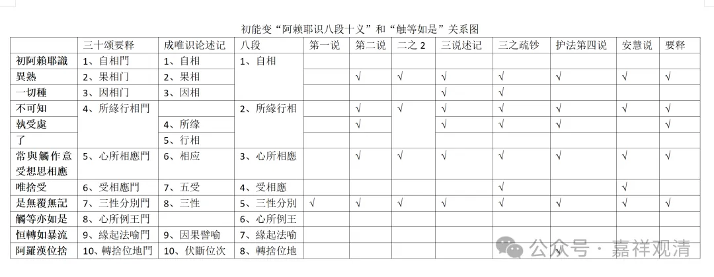

那么《成唯识论》本身还有一种分类用这个八段分类的，他说如果按照八段分类的话，就是果相门、所缘行相门，然后后面这两个“心所相应门”“无覆无记”是一样的，所以它就变成四个相应。

那么第三种，是难陀的，难陀论师就是讲没有自证分的，而许那个见分和相分的二分论家。难陀的说法是它是和前面几个都相应，你看见没有，他说的就是都相应，但是他说的都相应当中有两个也没有说——首先“异熟”没有问题，“一切种”这条他说是此处五遍行可以持种，这个是主要辩论的地方。主要辩论的就是在这个触、作意、受、想、思能不能持种。那这个呢看起来是没有什么差别，但如果要讲起来的话，难陀的说法，假如把“所缘行相门”是放在一起的话，这个和前面也是没有什么大的区别。

那么“唯舍受”相应呢，这两项有没有区别呢？没有讲，其实在《成唯识论》当中并没有很明确的说难陀有没有承认，唯是相应为舍受，但是要把它标出来的时候他没有标出来，没有说它和“唯舍受”相应，但是在《成唯识论疏钞》当中的灵泰说当中，他是把这个“唯舍受”相应是放上去的，我觉得灵泰的说法是有道理的，为什么呢？这个他如果要承认能够持种的话，他一定是“唯舍受”，这两个是应该是捆绑的，所以《疏钞》加了这一条，我觉得有意义，合理！灵泰的《疏钞》是有所见的，是很有点道理的。

那护法的意思是什么呢？护法的意思是第一说和第二说不全对，但也不能说错，因为它没有全对嘛，但是第三说肯定是错。什么呢？触、作意、受、想、思这五个遍行心所没有持种的功能，他和难陀主要在这里辩论。没有持种的功能，这个“唯舍受”也就没有了，“唯舍受”就不相应了。其他的都一样。

然后护法的还有一种说法，他说“触等亦如是”放在前面，其实和后面的也相应的。“**恒轉如暴流”** 是比喻就不用讲了，或者说“触等”本身不是“恒”的，它不是心王，所以它不是“**恒轉如暴流”** 的。但“触等亦如是”这个和阿赖耶识相应的这个触等，在“**阿罗汉位舍** ”，他说这个也是相应的。也就是这个是护法的正说。

要说《唯识三十论要释》全文基本上是按照护法说的，我没有理解此处他为什么没有按照这个护法的说法，1、有一种可能就是《要释》按照《成唯识论》都照抄了，但后面几句话他没看见，后面《成唯识论》有几句他没注意；2、也可能他就觉得他既然放在前面，放在第八个，它就只和第八个以前的相应，和后面两个不相应，否则它为什么不放到最后呢？这是我推测《要释》和《成唯识论》在此处不同的原因。但不管怎么样，这一段“触等亦如是”部分，昙旷《三十论要释》的说法和护法的正义是不同的。

