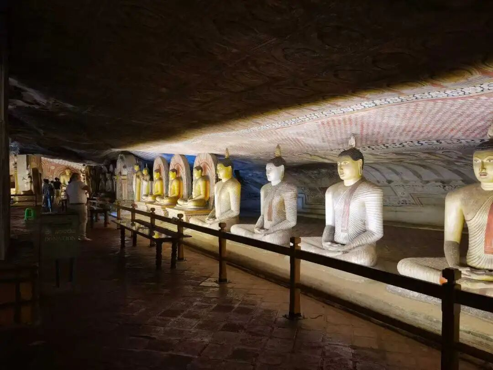

“**‘恒轉如暴流’，緣起法喻門。** ”

“恒转如瀑流”，按照它的意思我们今天讲“瀑流”啊，“暴流”“瀑流”意思完全一样。《成唯识论》的各个版本里也多做“暴流”，意思就是“瀑流”，到底念bao还是pu，我都没意见，这个是一千多年来的语音的演变而已。

若据梵文的原文，大致就是“恒转如流”的意思，《成唯识论》上下文中对这个“暴”好像也没解释，直接就说“恒转如流”，颂文为了汉语五字一句的结构，翻译为“恒转如瀑流”。

这部分是“緣起法喻門”，“法”是什么呢？阿赖耶识，“喻”是什么呢？瀑流或者暴流啊，我们有时候讲瀑流，有时候讲暴流啊，意思一样。

“**‘恒’謂此識無始時來，一類相續，常無間斷，是界、趣、生施設本故，性堅持種，令不失故。** ”

常无间断用恒无间断可能更好一点啊，但是已经用恒了，也就只能借“常”来解释了。阿赖耶识恒无间断，是三界、五趣、四生施设的根本。

三界：欲界、色界、无色界；

趣，五趣或者是五道或者是六道都可以啊；

生是四生：胎生、化生、湿生、卵生。

“**施設本故** ”，意思是这些都是由阿赖耶识而建立的，叫“施设本”。“性堅持種”，它的“性坚”，不被破坏；“持种”，他第八识有持种的这个能力；“令不失故”，令其本身不失。

