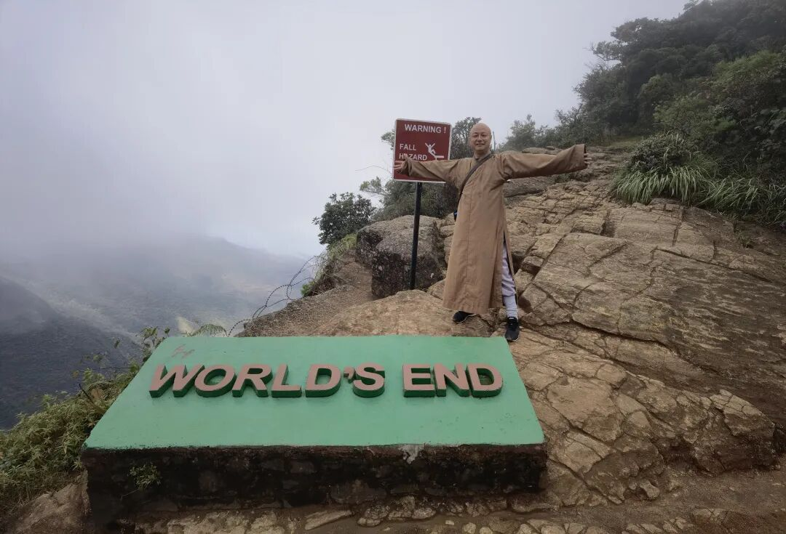
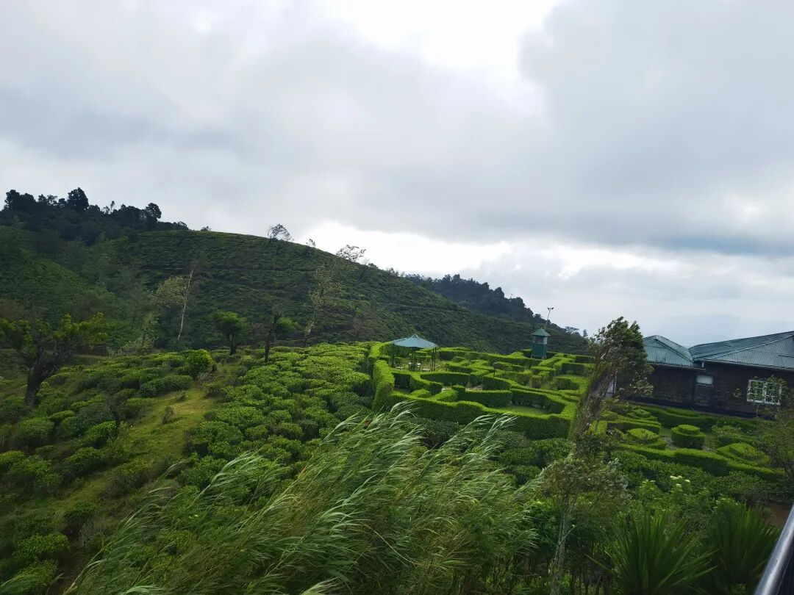
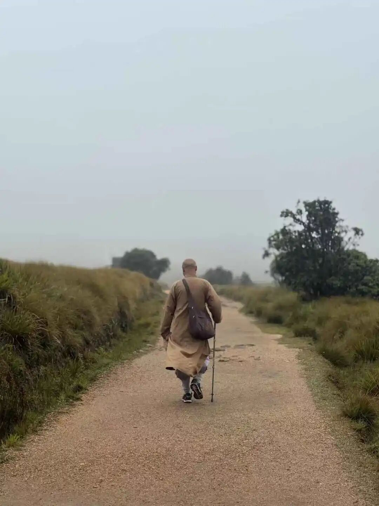
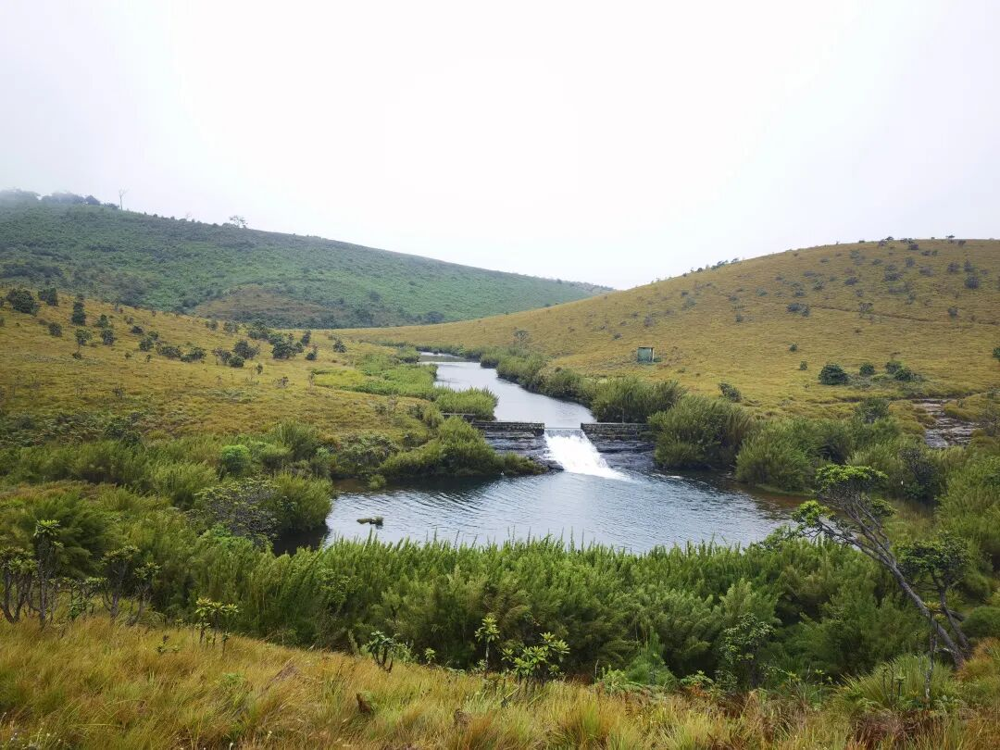
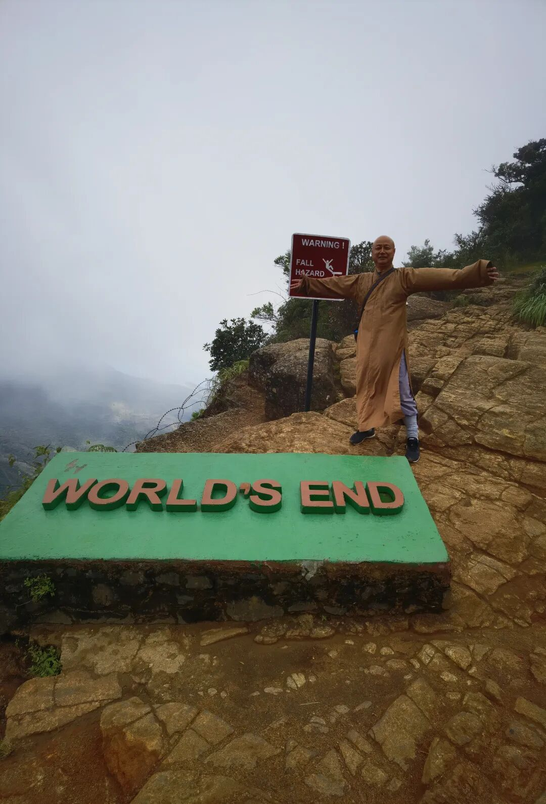
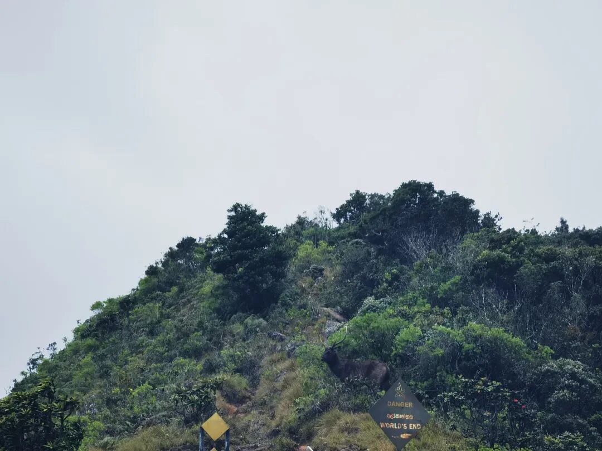
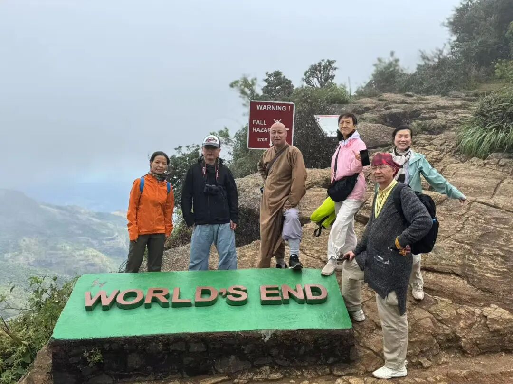

坐车赶路五小时，连载的《唯识三十颂要释》今天是来不及了，发一段小游记凑数吧。

兰卡游，昨晚到了茶山。这里海拔有一千到两千，是锡兰红茶的产地。

看到一本台湾作家介绍兰卡的书，说“这里到处都种红茶……”，这是文人常闹的科普笑话了，红茶、绿茶和制作工艺有关，并不存在红茶树、绿茶树、黑茶树。

酒店有茶农采的茶叶，采得很粗糙，杆子和茶叶叶片都不讲究，一杆基本五叶以上了，我们庙里谁要是这么采茶，估计是要被批评的。茶农工资一天折合人民币三十左右，大概是国内的一半。

今天一早徒步去“世界尽头”，海拔2000米，才13℃，风又大，直到把能穿的都套上了，才开始了高山九公里的徒步。英国人真能起名字，一个山顶陡坡安立个“世界尽头”的名言，忽悠老外老远来徒步……我高度怀疑是拿我们当外卖了～～因为山里有野豹子，我们还看到了它们的脚印……

这张照片中间有只🦌，看见没。

一路上，我的耳边都是《灌篮高手》的那支《直到世界尽头》，陈楚生版的，就一句——

“在冰冷森林中，我已孤独穿行太久……”

陈楚生演绎得真好，而我今天也真的是

在冰冷森林中，孤独穿行……

车上编完这段，继续赶路。我们的车已经出了高原低温区，现在车里暖和起来了……

好了，车上八卦课要开始了，今天就扯到这里～～