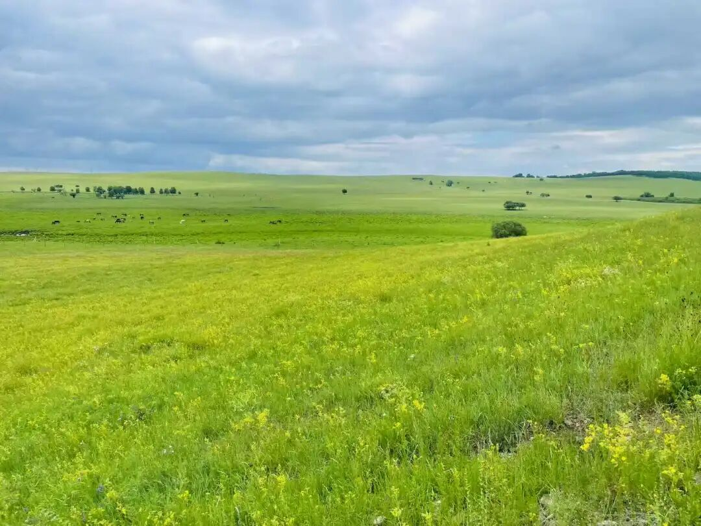

这个麁重我们讲过，麁重有几个意思啊？第一个意思就是烦恼、烦恼的别名，也是《集论》里面讲的，第二种意思烦恼的种子，第三种意思和轻安相反，身心轻安或者是身轻心安，和这个轻安相反。这里的麁重它的意思实际上是种子。

你看唯识在这里用个“麁重”，他用个“种子”不是更简单吗？放在这里，还要特别解释，很有点多此一举的意思……呵呵，作为一个中观师，我们好像随时随时怼它啊，其实中观也不见得完全没有这样的问题啊，谁让现在是我来讲他们的是吧？哈哈哈。

哎呀，说起来也是啊，当时这个小唐老唐思鹏44岁去世的好像是，他刚过世，有些师兄弟就让我出来讲唯识啊，我说我是中观的，我不是搞唯识的，现在好像唯识讲的东西也讲不少了，比讲中观还要多啊，讲唯识比讲中观有胆子啊，主要是我们中观的师父的水平太高啊，我怕讲了以后被他们骂，我的唯识师父们的水平……那理论上他们都是佛是吧？

呵呵呵，我反正现在我胆子比较大啊，不怕被唯识的人骂啊，怕被我的中观的师父们骂，包括像我们这种中观师来讲唯识，我是个中观师，但是唯识比我讲的这么好的也没几个，吧。当然了，我的这个对唯识经典的熟悉程度肯定没他们好啊，毕竟不是我的强项啊。但是他们的很多地方都不如我……不能再吹了，删了删了吧，哈哈……

那么他说什么呢，在烦恼和烦恼的种子都远离都被断除了以后，然后说舍阿赖耶识，并不是说第八识就没有了，舍得什么呢？舍得是阿赖耶这个名字，好，这是第一种说法，第一种说法是对的啊。

