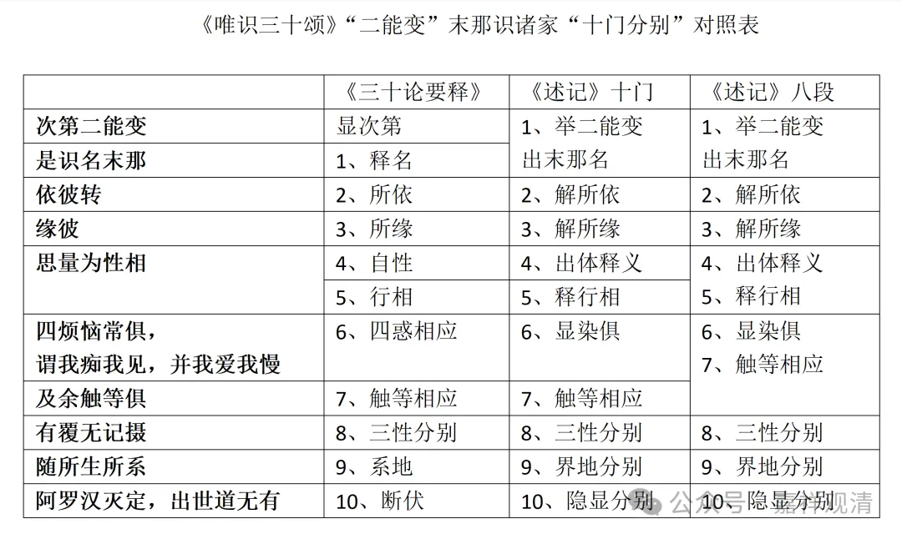

我们来看《三十论要释》对二能变（末那能变）的十门分别。

首先，**“是識名末那”** 这是识的名字，释名。

然后呢，“**依彼轉緣彼”** ，这个“**彼** ”就是阿赖耶识，这个是第二门，“所依”。

“**緣彼”是** 第三门，“所缘”，所缘是什么呢？所缘还是阿赖耶识。

**“思量為性相”。** 是第四、第五门分别，“自性”和“行相”。

**“四煩惱常俱”** ，这个是第六门分别——“四惑相应”。

**“及餘觸等俱”，** 这是第七，“触等相应门”，也可以说是心所相应门。

然后，“**有覆無記攝”，** 是第八，“三性分别门”。

**“隨所生所繫”，** 这个是第九“系地门”，界（三界）地（九地）所系。

**“阿羅漢滅定”** 等等，这是“断伏门”，按初能变的说法，就是“伏断位次门”。

我们来看一下啊，这个是《唯识三十颂要释》当中对末那识的十门分别啊。他的科判并不按照《成唯识论》，而是独立做了自己的科判。

对照的表格大家可以看一下。

