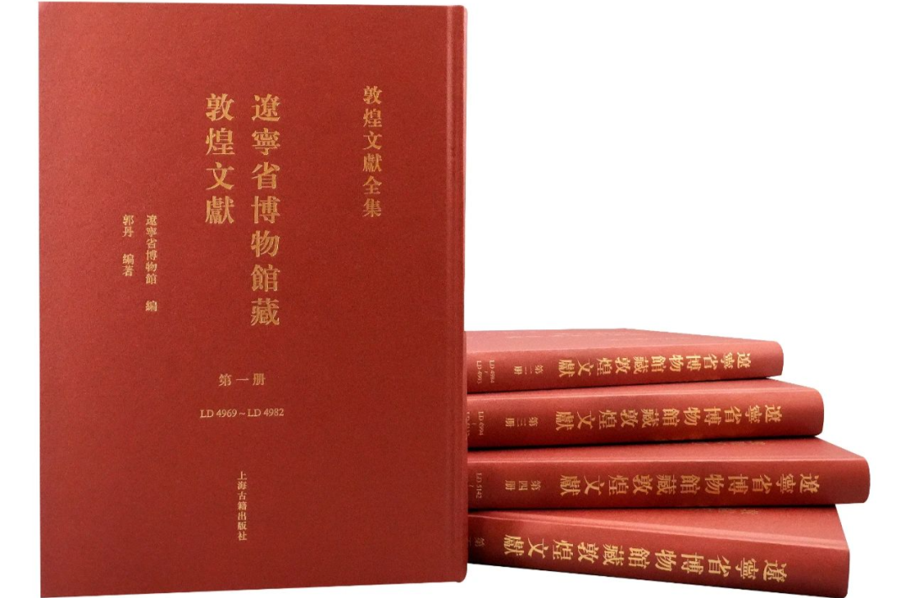

《大乘百法明门论开宗义记》，这个是“己”啊，实际上这个“己”就是通这个“记”。敦煌本的《开宗义记》这个字是属于差的（跟我的字有一拼），说明这个是在敦煌写的啊，这个写的人不是专门的“经生”抄写的啊，“经生”抄的文献字会好看许多，他们抄的东西现在我们拿来当字帖应该没有问题。

通过和《百法明门论开宗义记》的比对，我们推测《唯识三十论要释》的作者是昙旷，《唯识三十论要释》和《百法明门论开宗义记》是有相关联性的，**《百法疏》** 的大的科判和《三十论要释》一样的，我们现在的科判也照这个《百法明门论开宗义记》抄补了。

那么考证下来《三十论要释》的作者应该就是《百法明门论开宗义记》的作者，也就是昙矿。

《百法明门论开宗义记》是法藏的敦煌文献当中的……敦煌的这个文献，我这里有法藏的部分敦煌文献（我原以为我买全了，后来发现只是一小部分……），英藏的敦煌文献我也不全，而正好《三十论要释》是在英国所藏的敦煌文献里面，那部分我也没有，只有几张照片……潮州开元寺也没有，开元寺买的是国家图书馆藏的敦煌文献，我这里买的是法藏的一部分，英藏的我上网查了一下六万多……

现在《唯识三十论》的这个《要释》，它是在这个英国的国家图书馆藏的敦煌遗书当中，不是法藏的，也不是我们国家图书馆藏的，这个看了它的五50册，最便宜的是六万多，有机会去西园寺看看，我估计西园寺可能会有，西园寺的图书馆国内还是藏书比较全的。

现在还出了辽博藏的敦煌文献，也有昙旷的注疏（《起信论疏》）哦！我考虑考虑……

好，我们看回来啊。

**“恐繁blue，《百法疏》明”** ，我们现在就不写啦，也不讲啦，你要想知道的话呢，去看《百法明门论开宗义记》。

