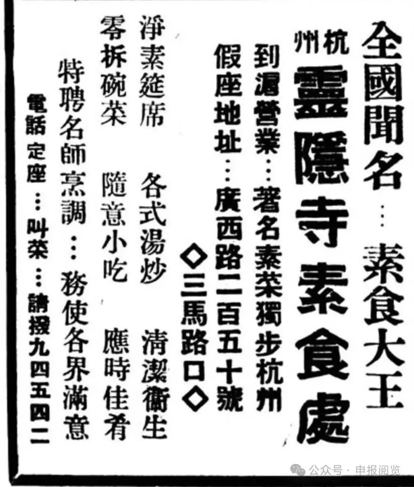
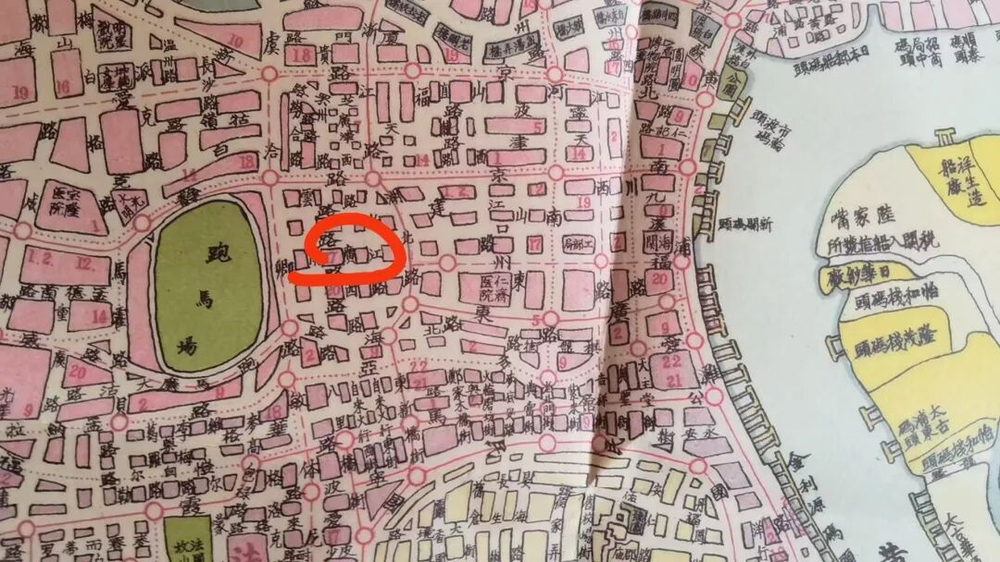
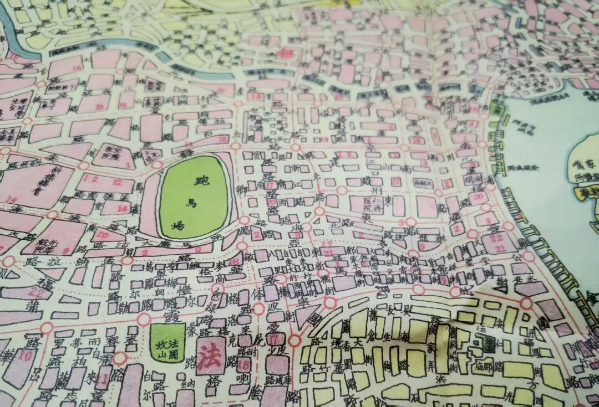
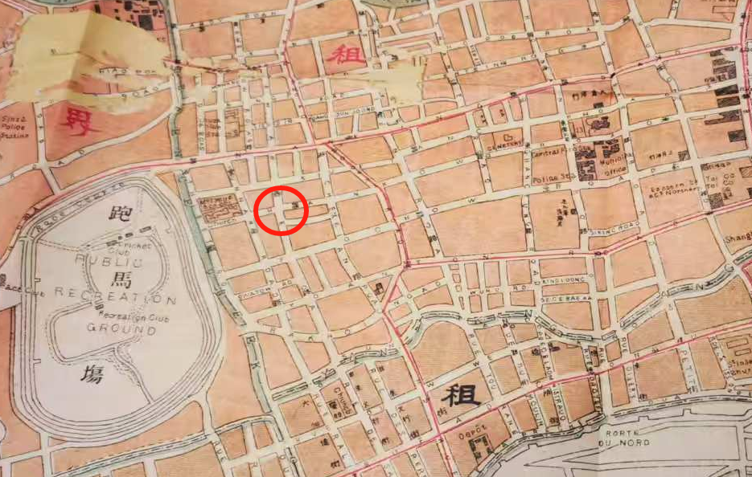
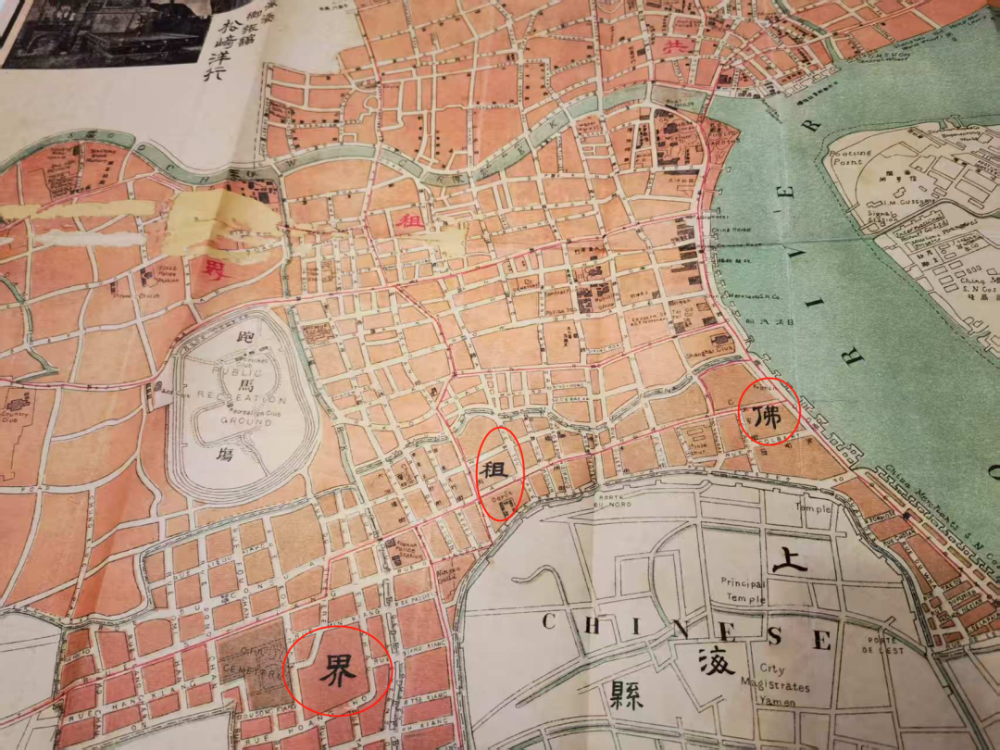

解放前上海素餐馆的广告

这是当年刊登于申报的一则素食馆广告——

“全国闻名…素食大王

杭州灵隐寺素食处

到沪营业…著名素菜独步杭州

假座地址…广西路二百五十号

三马路口

……”

大马路是南京路，二马路是九江路，三马路就是汉口路。大马路、二马路、三马路是民间的别名。

这个地方附近，大概二十年前也开过一个素斋馆，不知道今天还在不在了……

这是1943年版的上海地图。

应该在这个圈圈的位置。

这张图左下角绿颜色的“法国坟山”，今天是上海市的淮海公园。坟山的东面有过一个叫国恩寺的大寺院，国恩寺经常启建水陆法会做超度，这或许和他的地理位置有关——坟山对面。

国恩寺稍往南就是今天的曙光医院西院。

这是1913-1914年版的上海地图。圆圈里面就是那个灵隐寺素斋馆上海分部。

这幅地图里有个名字——“佛租界”。

看地方应该就是上海的法租界，France音译为“佛兰西”，就变成了“佛租界”或者“佛国租界”，但跟“佛”或者“净土”没有直接关系。

