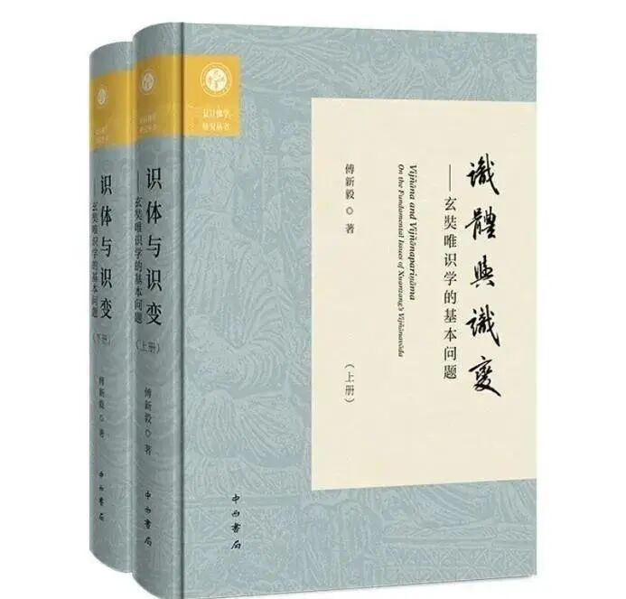

好，我们继续开始！《唯识三十颂要释》，作者唐·昙旷。这是一部仅存于敦煌的唯识学文献。

现在已经到了第七末那识的部分了，

**“次第二能變...出世道無有，四煩惱常俱，謂我癡我見，并我愛我慢，及餘觸等俱”，** 我们现在讲到这个地方，这个是第七识的部分。

**“及餘觸等俱”** ，上次讲到一点，就是**及，** 我们提到过非常多次了，在唯识当中，你要非常小心这些词，就是它有时候实词会做虚词用，有时候虚词会做实词用，比如说它这个“**及”** 是有意思的，是合集。

它这个“**餘”** 也是有意思的，一半我们一看就是“**及餘觸等俱”** 可能就把“及余”当虚词放过去了，这个“**餘”** 也是有意思，而且这个“**餘”** 各个唯识大师的讲法都不一样。现在《要释》主要用护法的意思来注释的，护法说这里的“**餘”** 就是随烦恼，其他（余）的随烦恼，说起来其实是单纯讲随烦恼都不够，那这个待会我们碰到的时候再说。

记住这个套路，这个“**及”** 和“**餘”** 都是有意思的，“**及”** 的意思就是除了触等以外，还有其他的；那“**餘”** ，其实就是这些东西要拼起来，“**餘”** 就是还有，比如说这里讲的随烦恼，说是“随烦恼等”，比如说还有那个别境心所当中的“慧”。

现在我们看到的这个说法是护法论师的说法，就是玄奘法师的师公，玄奘法师唯识的主要的师父在印度，主要师父叫戒贤，戒贤的师父叫护法，所以玄奘法师是属于护法论师这一系的，唯识派当中护法这一系，玄奘法师把这一系带回来以后，这一支后来在印度就失传了，或者说印度这一支基本上没传下来，那么这一支主要的在国内……

今天我还看了一篇文章，我没看完，《识体与识变——玄奘唯识学的基本问题》，作者是傅新毅教授。书现在已经印出来了，傅老师送了我一本签名本……这本书可以说是在国际学术的背景下，很认真的在给汉传佛教或者说是在帮玄奘法师这一系在立言的感觉……

这是玄奘法师这一系，护法、戒贤、玄奘法师这一系，后来在印度反而没有什么人，没看到有什么特别的留下来的东西。主要是玄奘法师带回来的。

