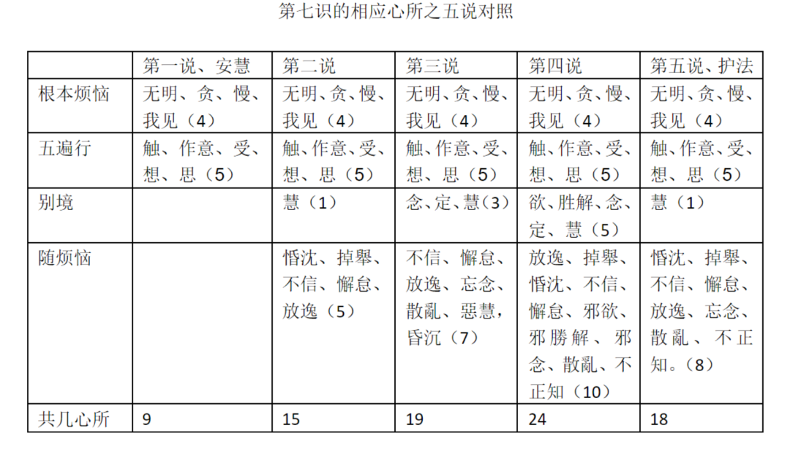

（3、第三说，第七识相应心所有十九，除第一说之九心所外，加别境之念、定、慧，加《瑜伽》五十五之随烦恼七——“不信、懈怠、放逸、忘念、散亂、惡慧，昏沉”；）

接下来第三说，第三个人说十五个不够，还要加到十九个心所。

别境里，他说要加念、定、慧。定刚才我讲过了，他觉得定心所要有。“念”，他认为念也有，正念的念，他说有，因为第七识一直在看着第八识，一直在观察着他……

染污的部分，前面（第二说）随《集论》，加的是五个，他现在说，凡是有染污心的时候就一定有七个，哪七个？不信、懈怠、放逸、妄念、散乱、恶慧、昏沉，还有一个恶慧……这个说法是谁讲的呢，这个说法出自《瑜伽师地论》卷五十五：

《瑜伽师地论》卷五十五：

“不信、懈怠、放逸、忘念、散亂、惡慧，與一切染污心相應。”

前面《集论》也是“一切染污品相应”。这里《瑜伽师地论》卷五十五拿这六个拿出来说。第三家他说我们就应该随顺《瑜伽师地论》的卷五十五，把这六个加进来，再加一个昏沉，他说我们就需要把这七个加进去——就是第七识的相应心所要加随烦恼七个，加上三个别境心所，就是十个，这十个加前面安慧说的九个，就是19个。这是第三说。

这个它的依据是《瑜伽师地论》。现在你前面一个（第二说）可以用《集论》说话，那我（第三说）可以用《瑜伽师地论》卷五十五说话。《瑜伽师地论》说这六个是所有一切染污心都相应的，再加一个昏沉，我这里用个逗号。

