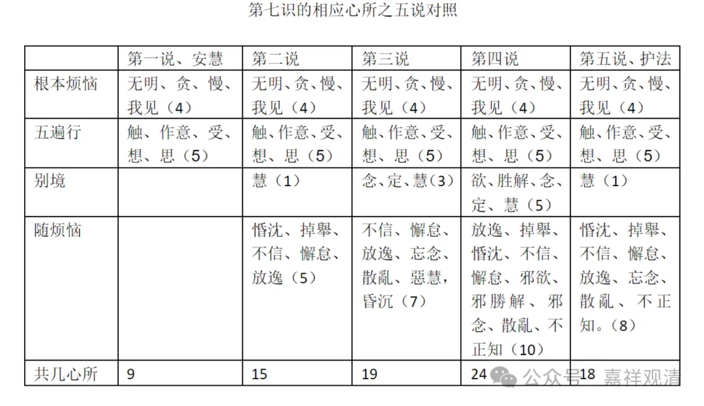

（4、第四说，第七识相应心所有二十四，即，“我痴、我见、我爱、我慢”四，加五遍行、五别境，加《瑜伽》五十八中的随烦恼十——“放逸、掉舉、惛沈、不信、懈怠、邪欲、邪勝解、邪念、散亂、不正知”；）

现在又有一个第四说。第四说的意思是，第三说的你已经用《瑜伽师地论》，那我也用《瑜伽师地论》了，他说“再加！还有，一共24个”，说第七识相应的心所有24个。

他说我痴、我见、我爱、我慢，这四个没问题，五遍行和五别境方面，他说五遍形五别境都有，这个可以这么理解，就是相当于他接受《俱舍》或者说一切有部系统的，它这个十个大地法，五变形五别境就是凡是心都有了，加上五遍行、五别境。

再加《瑜伽师地论》卷五十八，这里面的他有十个随烦恼。他说这十个随烦恼，和染污品恒共相应的。我们来看一下《瑜伽师地论》卷五十八——

《瑜伽师地论》卷五十八：

“放逸、掉舉、惛沈、不信、懈怠、邪欲、邪勝解、邪念、散亂、不正知，此十隨煩惱，通一切染污心起。”

（邪念在这里实际就是理解为失念或者是忘念。）这个是《瑜伽师地论》卷五十八说的。

那现在有三个是有教证的，就是第二说，第三说，第四说都是有教证的。第二说他的教证是《集论》，说这五个和一切染污品起；第三说是《瑜伽师地论》卷五十五，说六个和一切染污品起，再加一个昏沉；第四说他举的是《瑜伽师地论》卷五十八说，这十个和一切染污品起。

那么这样，除了安慧说以外加上了三个，这三个都是有教证的。

那么第三个它就出现了24个，这24个多了一些，如果我们现在回过来看的话，就是第三说和第四说里面稍微有点问题，这里有个慧。那么不管你是恶慧还是什么慧，它都算是慧，是这样的话，这个恶慧要删掉。如果我们现在回应他的话，你这个恶慧也是慧，你不是单独一个心所，恶慧也是慧，那在这里别境慧不是有了吗？即使你这个教证是对的，那这个也要放在别境慧这里。那如果是这样的话，这个恶慧就没有了。

那么这个《瑜伽师地论》卷五十八也是，按照这里说法，那就是邪欲、邪勝解，那么按照你说的是有邪欲和邪胜解，那么前面又加上有五别境。那么既然有五别境了，五别境里面有欲、胜解、念、定、慧，你这两个也要删掉，你这两个删掉就剩下八个了，因为这个邪念就是妄念，看得出来吗？看懂了吗？

你们把百法背下来的话，这里就比较轻松一点。因为随烦恼当中，如果以成熟期的阿毗达磨里，随烦恼当中是没有恶慧的。如果不成熟的话，或者其他宗派的这个阿毗达摩当中，像这些恶慧、邪精进就都出现了，也有邪精进，正精进，慧当中有邪慧等等。它确实可以有，但是现在我们后期唯识的阿毗达磨当中，他已经有了比较精确、统一的一个说法。所以这个“恶慧”就不需要出现了，你这个恶慧也是慧，就是前面欲、胜解、念、定、慧的这个慧。别境的慧，除了安慧没有加，其他大家都加了。因为他说有“我见”的嘛。

同时这里也是，五别境当中有欲、胜解、念、定、慧。那邪欲、邪胜解就不在独立罗列了，这两个就可以不用了。用它干嘛呢？因为在五别境里面都有了，都存在了。所以你说他有24，但这两个至少不能有。

