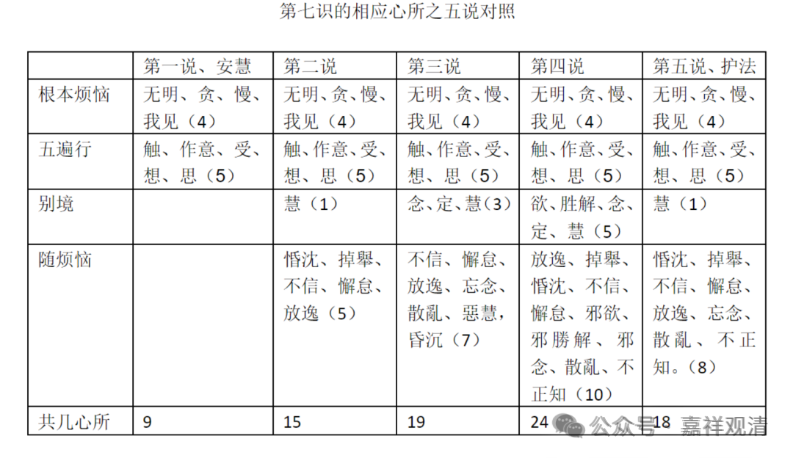

（5、第五说，护法自宗，有十八，即，“我痴、我见、我爱、我慢”四，加五遍行，别境慧，加大随烦恼八。）

第五家说法就是前面讲的护法自宗，我们刚才读起来是觉得很简单就过了。但是护法说它有十八。对护法来说，它有一个比较缺的一个。

我们回过来看——安慧很简单，安慧说文字上，《唯识三十颂》当中的文字就只有“我痴、我见、我爱、我慢”和“触等俱”，而这个“余”到底是什么？安慧的意思是没有直接对应的心所，他认为在《唯识三十颂》当中是没有提出来的，他可以说“我不认为有”。那么，第二说它是有《集论》作依据的，第三说有《瑜伽师地论》卷五十五，第四说有《瑜伽师地论》卷五十八作为依据……

那么现在第五说，护法说，这个护法说是没有教证的。我们可以认为他就把前面的所有有教证的四说全给批了，这个就比较厉害了！

你们也可以看出来，不管在什么地方，教证、理证、例证，最后是以这个理证为主，最后是理证说了算，而且相对来说（、比较起来），护法说的看起来似乎更好一点。

所以在辩论背景下，不是说“我有了教证，有了经典背书，我就必须能赢！”，不是这样的。外面现在讨论的时候经常是好像有一个教证就自以为自己赢了，“我用个 google 、用个百度把这一段说出来以后，那我就赢了”。在真正的佛教界是没有用的（文盲、半文盲玩的那些不算这里讨论的对象），你看这里，把《瑜伽师地论》搬出来都没用，你把《集论》搬出来都没用。我可以继续觉得你的解释有问题，即使你都把《瑜伽师地论》都能搬出来，把无著都搬出来了，或者说是把弥勒都搬出来了，这里我只要是一句话，“不了义”“不究竟”，这个事情就完了——教证（经典里的文字）不是最终的答案，在双方解读不一致的情况下，需要进一步解释。

这种习惯到我们的《唯识三十颂》的后面，或者《成唯识论》的后面都是这样的。几乎所有的心所在这里面讨论的时候，几乎所有的都要讨论一个问题，也就是《集论》、《瑜伽师地论》卷五十五和《瑜伽师地论》卷五十八很多说法不一样。我们怎么去理解？所以护法论师站出来继续给予“解释”。

