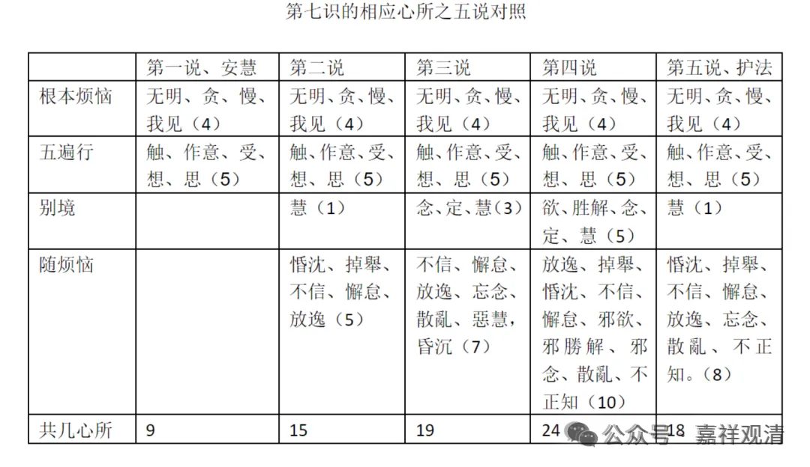

《唯识三十论要释》讲义·010·011

那么以现代学术的视野的来理解，（我写过一篇论文提到）到《百法明门论》的时代这样今天我们熟悉的心所的大致最后的固定，是很晚才成熟的。

在《瑜伽师地论》的时候，这个心王、心所的展开……心王基本上没问题，心所到底有多少个咋当时并没有直接固定下来，甚至连“别境心所”都没有固定下来。五遍行心所在《瑜伽师地论》当中已经出现出来了，而且是第一次出现，“别境心所”的名词在《瑜伽师地论》当中还没有出现，《瑜伽师地论》里边“欲胜解念定慧”只被称为“五不遍行”，“别境心所”这个名词最早出现是在无著论师的《显扬圣教论》中……

到了世亲的《百法明门论》基本上把这个遍行、别境等五十一个心所，最终固定下来了。

如果把六个根本烦恼，把它扩张成十个根本烦恼的话，那就五十五个心所。

那五十一个心所也好，五十五个心所也好，这种说法基本上是在世亲的后期的作品中才固定下来。

前面所引用的《集论》是无著论师的作品，《瑜伽师地论》两、三种说法，一种说作者是无著，一种说作者是弥勒的，一种说前五十卷作者为弥勒，后五十卷作者为无著。我的意见呢，略接近最后一种。

那总的来说，《集论》《瑜伽师地论》都是瑜伽行派的论典里面比世亲的后期的《唯识三十论》创作的时间是要早的，比《百法明门论》的创作时间也是要早的。《集论》《瑜伽师地论》的很多说法还不是唯识的（世俗眼光下）巅峰时期的说法——按汉传唯识的说法，护法论师代表的就是唯识的巅峰。

汉传唯识认为护法论师所代表的是印度唯识学的成熟时期，特别在心王、心所等的建立上，护法论师的抉择、建立得是比较成熟的。作为一个印度人，他（护法）不像我们有那种圣典崇拜，因为在他眼里，类似《集论》的作者这些很多只是比他稍早的同时代人，在他眼里看来，那些经典的表述不是不可以讨论的，所以就像现在我们看到的，当过去的经典和护法的思想有矛盾的时候，护法说：“我们要在这个道理上掰扯掰扯……”

那么护法最后的掰扯就是刚才我讲的这些，甚至所谓的“八大随烦恼”（说一切染污心相应的是八大随烦恼）也都是由护法“掰扯”出来的。

