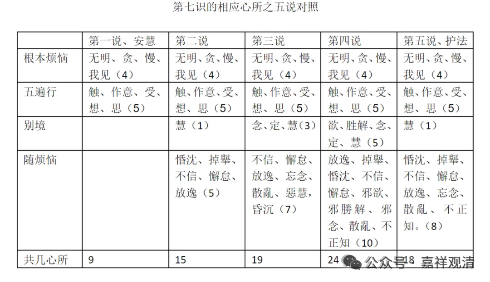

我们再回来看表格，缩小一点

一切染污心所相应，就是护法说，最后抉择出来是这八个（掉舉、惛沈、不信、懈怠、放逸、失念、散亂、不正知）一切染污心相应。

忿、恨、恼、害、悭、嫉、谄、诳、憍、覆，刚才讲了，这是什么？小随，这个是可以独立生起，学习理解的时候记住不要漏字，是“可以”独立生起的，不是“必须”独立生起。那么无惭、无愧是“遍不善”，这个不是恒行生起的；而八大随烦恼是“遍染心”。这里的大中小是从他们生起的普遍性上分的——大随最普遍，小随则特殊朝向时才能生起。

护法说，对第七识相应的心所的解释，前面的解说都不完美，不管是基于这个《集论》还是《瑜伽师地论》。在《成唯识论》的后面，这种情况也是经常出现的。

这里为什么把这一段专门拿出来讲，因为再往后面我可能就不给你们多讲护法“纠正”其他论师定义的地方了，因为不需要在这门课程里扩充太多的东西。毕竟我们不是细讲《成唯识论》。这里专门把护法的套路（更倾向于理证）提出来讲的原因就是让大家知道，让大家熟悉护法论师的这个习惯……

就提高理证的地位来说，当年印度就是这样的，印度这个辩论的风格是被带到了他的北方邻国……辩论不是把一个教证、把权威搬出来就直接掌握话语权了，对一些没有学过逻辑的人，这种“诉诸权威”固然好像是你掌握了话语权，但是诉诸权威的“真理势能”（临时编的名词）不如诉诸理性，在诡辩术里，有一种就叫“诉诸权威的诡辩”。但是现实层面，绝大部分人的水平是认为权威胜过理性的——因为绝大部分人的理性太薄弱。

