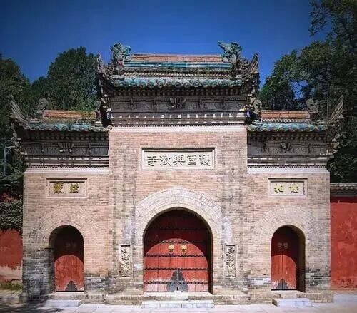
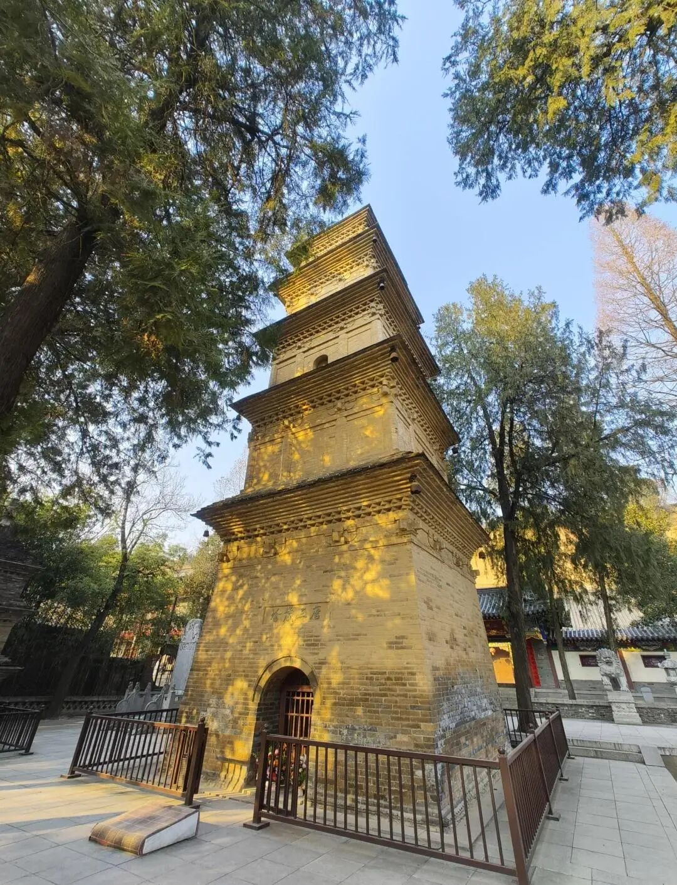

上次我们讲过，我们大致上可以认为，《成唯识论》说起来是翻译的，但实际上玄奘法师编撰的“部分”是很多的，因为很多《成唯识论》并不是就是有梵文原文一一对应，我们也对了，很多和原文也很接近……但以今天我们的著作权、版权意识来看《成唯识论》，我们就不很容易完全把他当做印度的文字来看了，它（《成唯识论》）应该算是很具备玄奘法师的个人的作品了，是把十本拼在一起的，应该算是某种大型的文献综述了。

那么这个《成唯识论》我们先再来看他的这个文字，包括他的结构等等，也可以看出玄奘法师蛮有“野心”的，他创造了新的汉传的一种是文风，一种是解释方式，都不完全是按照印度来的，这种严谨的解释方式，在汉文化里面以前是很少见的，他的文字的运用是非常严谨的。中国历史上文字严谨到这个程度的佛教的注疏、作品极少——这一点基本可以和印度原生的相媲美了，甚至从某种角度上来说，甚至还要更高一层，因为它不只是“照着说”的，虽然它是以护法说为基础。

第二个，玄奘法师，他的中文功底和辩论的功底都很深，这从行文内容里面可以看出来。这个文字这么仔细，用词这么谨慎，可以看出他的辩论（逻辑）功底一定是非常好的。这一点，玄奘法师的门人们比起玄奘法师来是有点不如的，但都属于汉传佛教史里的巅顶位置了，其中基法师、圆测大师都算是中佛史上超一流的大师，唐代再往下几代的唯识系统，基法师再往下几代的这些水平其实都挺高的。

那么我们也可以发现，像敦煌昙旷他们，不是特别正宗的玄奘法师这一系的，他跟真谛那一系有点关系，那他们的文笔等等就相对来说是不如玄奘法师这直系的这些大师们。

我们前面讲过了，《唯识三十颂要释》当中，昙旷法师他按照自己的想法改动、或者也写了不多的一些文字，但是在对文字的驾驭上，逻辑、理论水平上都要比奘师的直系门人弱至少一个等级到两个等级，他没有达到玄奘法师门下直系弟子的顶尖水平，那些大师们的水平更高一些。

文字上（我们看得顺眼的文字）能够比较好的人，基本上逻辑上也会比较好，这跟学因明等等都有关系。当然还有一个问题就是教学，你老师是这样教学的，你单纯的旁听是不够的，必须要纯“带”出来的，应该跟师父以师带徒的方式学习，像中医世家的经验授受一样。

……所以玄奘法师并不是像大家所想象的那样只是单纯地在翻译，虽然看起来他好像“单纯做翻译”“述而不作”，但是他确实是想建立汉地的这个一整套的学习方式，很可惜“秦人好简”，不爱学习……基本上，他翻译的东西我们现在的佛教徒基本上是不看的。中国的大藏经里面有1335卷是他翻译的，我们有多少人这辈子是看完的，不知道，很少。

所以那次去玄奘法师那个全身塔的时候，（兴教寺，这个在西安西南面一点，）我一走进去就哭了，当时也是有这个想法——你那么努力，翻译得这么用功，翻译的这么多的好东西，都蒙尘投暗，都不被认识……其实我们这些后人是很对不起这些大译师们的……。

