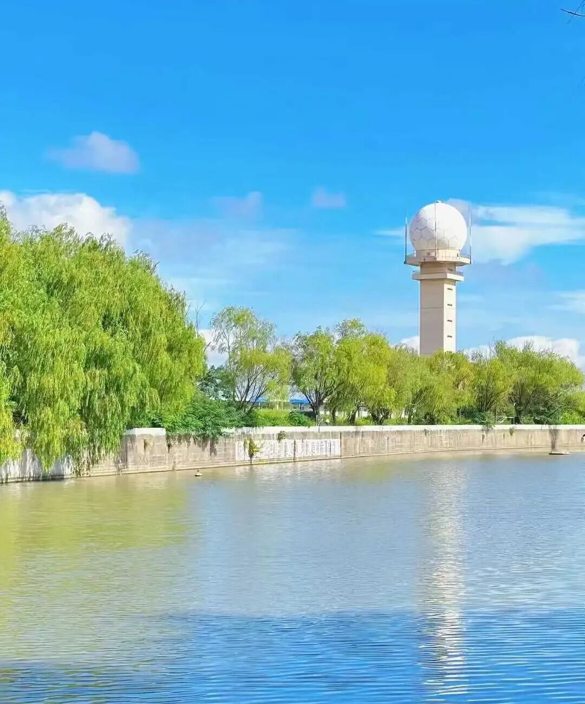

**“謂染污意，無始時來，微細、一類、任運而轉，諸有漏道不能伏滅；三乘聖道有伏滅義，真無我解違我執故。”**

对这个来说，你看这一定要加“染污”或者是“染末那”，因为他是染污的。

此染污意，“无始时来微细……”，染污意是微细的前面也说过，“此俱染法，所依細故”，染污意、第七识都必须微细。如果他不是微细的话，那我们就不用讲了，比如说就像眼、耳、鼻、舌、身这些识，大家一听就明白，但是第七识、染污意，除了（学）唯识的人基本上不明白，所以他说这个是很“微细”的——如果微细你们不是马上就知道了吗？对吧。

染污意是微细的、一类的、任运的，是前后相应的，他只缘阿赖耶识，“任运”，因为他只是不停的做一件事——缘阿赖耶识，只要我们有心的时候，特别是凡夫的这个时候，或者说是在我们还有根本烦恼没断的时候，他是一直相续不断任运生起的，所以叫“微细、一类、任运而转”。

“诸有漏道不能伏灭”，有漏道是什么？“有漏道”实际就是世间道。单纯靠世间禅定的力量不能够压伏、断除这个染污意，因为世间道不能对治这个我执。

學位的“滅定”“出世道”中，则是出世。世间道单纯靠禅定的力量能不能伏灭这个第七识？不行！世间道没有断我执的这个能力。

现在讲的是第七识在染污意的这个时候，在世间道、有漏道的手段不能伏灭这个第七识的染污的分位。只有无漏道“滅定”、“出世道”可以伏或者断，前面要讲个出世道。學位“滅定”“出世道”中，这个是可以伏、灭的。

